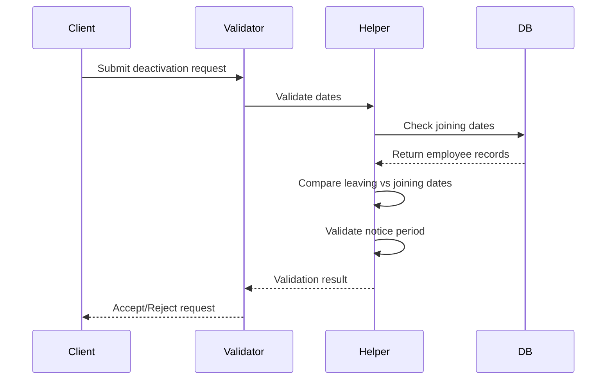
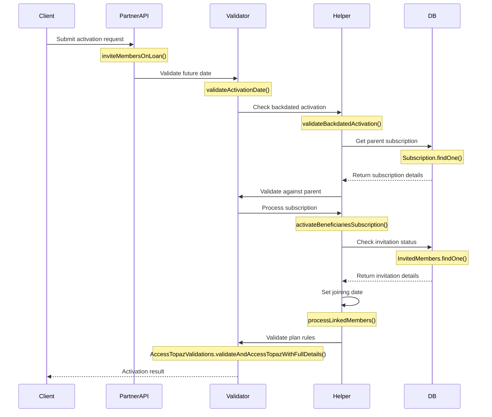

## Date Validation Rules

### General Date Validation Rules
1. **Joining Date Validation**
   - Must be a valid date
   - Cannot be in the future
   - For new subscriptions, cannot be in the current month
   - Must be before the leaving date (if leaving date is specified)

2. **Leaving Date Validation**
   - Must be a valid date
   - Must be after the joining date
   - For employer deactivation:
     - Must be in the future or current date
     - Cannot be before any active employee's joining date
     - Must respect the notice period if specified in the contract

### Employer Deactivation Date Rules
1. **Bulk Deactivation Dates**
   - When deactivating an employer, all associated employee leaving dates are validated
   - System ensures no employee leaving date conflicts with their joining date
   - Partial deactivations must have valid future dates

2. **Date Validation Process Flow**


3. **Date Validation Error Cases**
   - Leaving date before joining date
   - Invalid date format
   - Past date for future deactivation
   - Date conflicts with billing cycle
   - Notice period violations

4. **Special Cases**
   - Immediate deactivation (requires special permissions)
   - Retroactive deactivation (requires admin approval)
   - Bulk date modifications
   - Partial deactivations with different dates

### Date Validation Implementation
```javascript
// Example date validation checks
function validateDeactivationDates(joiningDate, leavingDate) {
    // Ensure dates are valid
    if (!isValidDate(joiningDate) || !isValidDate(leavingDate)) {
        throw new Error('Invalid date format');
    }

    // Check leaving date is after joining date
    if (isLeavingDateBeforeJoiningDate(joiningDate, leavingDate)) {
        throw new Error('Leaving date cannot be before joining date');
    }

    // Validate against current date
    if (isPastDate(leavingDate)) {
        throw new Error('Leaving date must be current or future date');
    }

    // Additional employer-specific validations
    validateEmployerDeactivationRules(joiningDate, leavingDate);
}
```

### Best Practices for Date Handling
1. **Input Validation**
   - Always validate date formats before processing
   - Use ISO 8601 format for consistency
   - Implement timezone handling

2. **Error Handling**
   - Provide clear error messages for date validation failures
   - Log validation errors for auditing
   - Include specific date requirements in API documentation

3. **Performance Considerations**
   - Cache frequently accessed date validations
   - Batch validate dates for bulk operations
   - Optimize database queries for date comparisons

### Member Activation Date Validation Flow

1. **Initial Partner API Validation**
   - First validation layer at the partner API level
   - Validates that joining date is not in the future
   - Uses Asia/Kolkata timezone for consistency
   ```javascript
   if (member.joining_date && moment().tz("Asia/Kolkata").unix() < member.joining_date) {
       throw new PartnerApiError("Activation Date cannot be future date")
   }
   ```

2. **Backdated Activation Validation**
   - Validates member's joining date against parent subscription
   - Ensures joining date is not before parent subscription's joining date
   - Also checks against plan purchase date if joining date not available
   - Applied to both primary and linked members
   ```javascript
   async function validateBackdatedActivation(recipient, parent_subscription) {
       if (parent_subscription.joining_date) {
           if (parent_subscription.joining_date > recipient.joining_date)
               return true
       } else if (parent_subscription.plan && parent_subscription.plan.purchase_date) {
           if (parent_subscription.plan.purchase_date > recipient.joining_date)
               return true
       }
       return false
   }
   ```

3. **Partner Integration Handler Validation**
   - Additional validation layer for partner integrations
   - Compares activation date with current timestamp
   - Returns false if date is in future
   ```javascript
   function validateActivationDate(activationDate) {
       if (utils.isEmpty(activationDate)) return null;
       const startDayTimestamp = dateUtils.getStartOfDayTimestamp(activationDate);
       return (dateUtils.compareTimeStamps(startDayTimestamp, 
               dateUtils.getUnixTimeStampInSecond()) >= 0) ? false : true;
   }
   ```

4. **Subscription Activation Flow**
   - Sets joining date based on invitation creation date
   - Allows 3-day window for activation after invitation
   - Applies to both self and linked members
   ```javascript
   let joiningDate = null
   let selfBen = beneficiary_list.filter(b => b.relation.toLowerCase() === 'self')
   if(selfBen && selfBen.length){
       let invitedMember = await InvitedMembers.findOne({
           mobile: selfBen.phone_number,
           status: { $in: ['invited']}, 
           plan_id: plan_details._id
       })
       if(invitedMember && moment().subtract(3, 'days').unix() < invitedMember.created_at) {
           joiningDate = invitedMember.created_at
       }
   }
   ```

5. **Beneficiary Helper Validation**
   - Additional validation for Topaz plan members
   - Validates joining date against plan-specific rules
   - Throws error if validation fails
   ```javascript
   let validateResult = await AccessTopazValidations.validateAndAccessTopazWithFullDetails(
       self_user_details, 
       self_user_details.joining_date
   );
   if(validateResult && !(validateResult.status)){
       throw new AccessTopazValidationError(validateResult.message);
   }
   ```

6. **Auto Activation Validation**
   - Validates member status before auto-activation
   - Checks if plan is already active
   - Verifies member hasn't been deactivated
   ```javascript
   async function prepareDataForActivation(entity) {
       let isPlanAlreadyActive = await checkIfCustomerIsNotOnboarded(body);
       if (isPlanAlreadyActive) return;
       
       let isMemberDeactivated = await checkIfMemberIsDeactivatedAndNotInvitedAgain(body);
       if (isMemberDeactivated) return;
   }
   ```

7. **Date Filter Validation**
   - Validates date ranges for filtering members
   - Ensures start date is before end date
   - Validates against employer creation date
   ```javascript
   if (request.body.filter.hasOwnProperty('joining_end_date') && 
       request.body.filter.hasOwnProperty('joining_start_date')) {
       beneficiary_helper.validateDateFilter(
           filter.joining_start_date, 
           filter.joining_end_date, 
           employer_created, 
           "Invalid activation date provided"
       )
   }
   ```

### Activation Date Validation Sequence


### Activation Date Validation Rules Summary
1. **No Future Dates**
   - Activation date cannot be set in the future
   - All date validations use Asia/Kolkata timezone
   - Future dates are rejected at multiple validation layers

2. **Parent Subscription Consistency**
   - Member joining date must be after parent subscription date
   - Plan purchase date is used as fallback
   - Linked members follow same validation rules

3. **Invitation Window**
   - 3-day activation window after invitation
   - Joining date set to invitation creation date
   - Applies to both self and linked members

4. **Plan-Specific Rules**
   - Topaz plan has additional validation rules
   - Plan category affects date validation
   - Special handling for different plan types

5. **Auto-Activation Rules**
   - Validates member status before activation
   - Checks for existing active plans
   - Verifies deactivation status

6. **Date Range Validation**
   - Start date must be before end date
   - Dates validated against employer creation
   - Proper date format enforcement