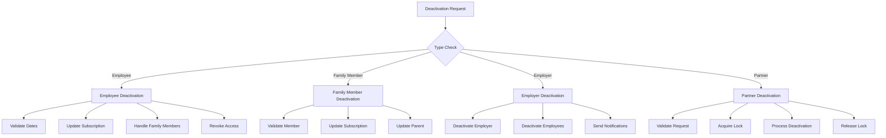
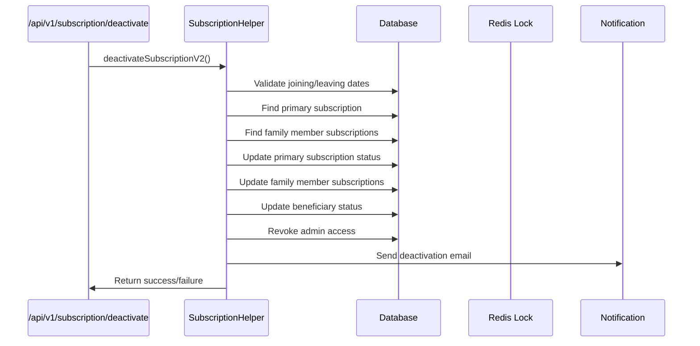
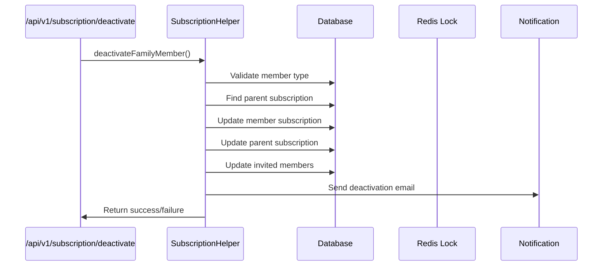
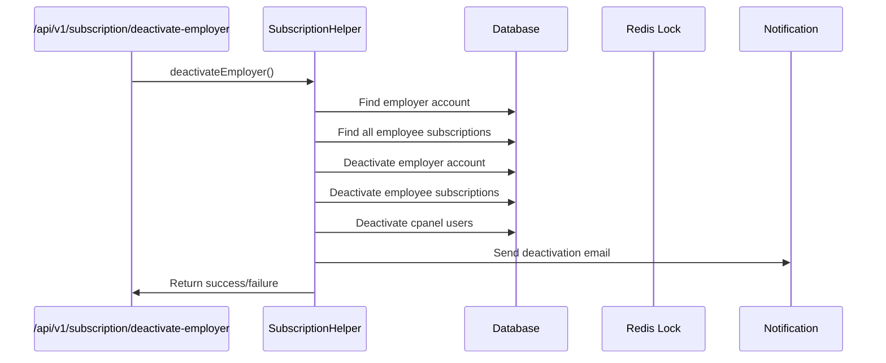
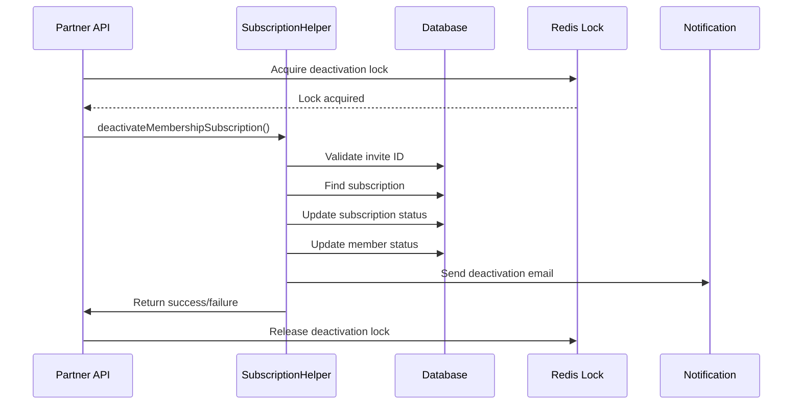

# Deactivation Flow Documentation

## Overview
The deactivation system handles various types of deactivations in the EmployeeSure platform, including employee deactivation, family member deactivation, employer deactivation, and partial deactivations. This document outlines the different deactivation flows and their implementation details.

## Types of Deactivation

### 1. Employee Deactivation
- **Trigger**: When an employee leaves the company or needs to be deactivated
- **Flow**:
  1. Validates leaving date and reason
  2. Deactivates primary subscription
  3. Handles associated family member subscriptions
  4. Updates beneficiary status
  5. Revokes admin access if applicable

### 2. Family Member Deactivation
- **Trigger**: When a family member needs to be removed from coverage
- **Flow**:
  1. Validates the member is not a primary member
  2. Updates subscription status
  3. Updates parent subscription records
  4. Updates invited members status

### 3. Employer Deactivation
- **Trigger**: When an entire employer account needs to be deactivated
- **Flow**:
  1. Deactivates employer account
  2. Deactivates all employee subscriptions
  3. Deactivates employer cpanel users
  4. Handles partial deactivation if specified
  5. Sends deactivation notification emails

### 4. Partner Integration Deactivation
- **Trigger**: When deactivation is initiated through partner integration
- **Flow**:
  1. Validates invite ID and reason
  2. Implements locking mechanism to prevent concurrent deactivations
  3. Processes deactivation through subscription helper
  4. Handles response formatting for partner API

## API Endpoints

### Internal APIs
1. `/api/v1/subscription/deactivate` - Main deactivation endpoint
2. `/api/v1/subscription/deactivate-employer` - Employer deactivation endpoint
3. `/api/v1/employer/beneficiary/deactivate` - Beneficiary deactivation endpoint

### Partner APIs
1. Partner deactivation endpoint with invite ID and reason

## Deactivation Process Flow

## Detailed Control Flows

### 1. Employee Deactivation Flow

### 2. Family Member Deactivation Flow

### 3. Employer Deactivation Flow

### 4. Partner Integration Deactivation Flow

## Key Components

### 1. Subscription Helper
- Handles core deactivation logic
- Manages subscription status updates
- Processes different types of deactivations

### 2. Deactivation Locking
- Implements Redis-based locking
- Prevents concurrent deactivations
- Ensures data consistency

### 3. Notification System
- Sends deactivation emails
- Updates activity logs
- Handles integration notifications

## Error Handling

1. **Validation Errors**
   - Invalid dates
   - Missing required fields
   - Invalid member types

2. **Process Errors**
   - Concurrent deactivation attempts
   - Database operation failures
   - Integration failures

3. **Recovery Mechanisms**
   - Automatic lock release
   - Error logging
   - Status tracking

## Best Practices

1. **Before Deactivation**
   - Validate all input parameters
   - Check for active processes
   - Verify member status

2. **During Deactivation**
   - Use transaction where applicable
   - Implement proper locking
   - Log all actions

3. **After Deactivation**
   - Send notifications
   - Update audit logs
   - Clean up temporary data

## Monitoring and Logging

1. **Activity Tracking**
   - Deactivation requests
   - Success/failure status
   - Processing time

2. **Error Monitoring**
   - Failed deactivations
   - System errors
   - Integration issues

3. **Audit Logs**
   - User actions
   - System changes
   - Integration events 