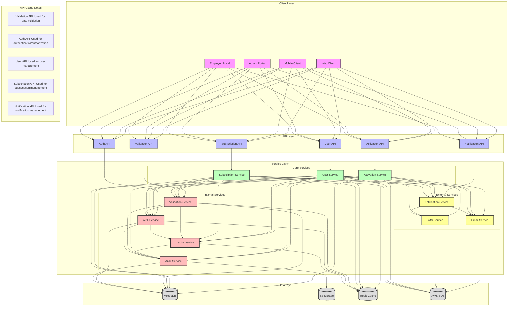

# Activation Flow

## Overview
The activation flow manages the process of activating users, subscriptions, and services in the EmployeeSure system. It integrates with user management, subscription management, and notification services.

## High-Level Design



## Sequence Diagram

```mermaid
sequenceDiagram
    participant Client
    participant Server
    participant ActivationController
    participant ValidationService
    participant UserService
    participant SubscriptionService
    participant Database
    participant Cache
    participant NotificationService
    participant EmailService
    participant SMSService
    participant AuditService

    %% User Activation Flow
    Client->>Server: POST /api/v1/activation/user
    Note over Client,Server: Request Body:<br/>{<br/>  "user_id": "user_id",<br/>  "activation_type": "type",<br/>  "activation_details": {<br/>    "email": "email",<br/>    "phone": "phone"<br/>  }<br/>}<br/>Headers:<br/>- Authorization: Bearer jwt_token<br/>- Content-Type: application/json
    Server->>ActivationController: Activate User
    ActivationController->>ValidationService: Validate Request
    ValidationService-->>ActivationController: Validation Result
    ActivationController->>UserService: Get User Details
    UserService-->>ActivationController: User Data
    ActivationController->>Database: Update User Status
    Database-->>ActivationController: Update Confirmation
    ActivationController->>Cache: Update Cache
    Cache-->>ActivationController: Cache Update
    ActivationController->>AuditService: Log Activation
    AuditService-->>ActivationController: Audit Confirmation
    ActivationController->>NotificationService: Send Activation Notification
    NotificationService->>EmailService: Send Email
    EmailService-->>NotificationService: Email Sent
    NotificationService->>SMSService: Send SMS
    SMSService-->>NotificationService: SMS Sent
    NotificationService-->>Client: Activation Notification
    ActivationController-->>Client: Activation Status
    Note over ActivationController,Client: Response Body:<br/>{<br/>  "user_id": "user_id",<br/>  "status": "activated",<br/>  "message": "activation_message"<br/>}<br/>Headers:<br/>- Content-Type: application/json

    %% Bulk User Activation Flow
    Client->>Server: POST /api/v1/activation/user/bulk
    Note over Client,Server: Request Body:<br/>{<br/>  "users": [<br/>    {<br/>      "user_id": "user_id",<br/>      "activation_type": "type",<br/>      "activation_details": {<br/>        "email": "email",<br/>        "phone": "phone"<br/>      }<br/>    }<br/>  ]<br/>}<br/>Headers:<br/>- Authorization: Bearer jwt_token<br/>- Content-Type: application/json
    Server->>ActivationController: Bulk Activate Users
    ActivationController->>ValidationService: Validate Request
    ValidationService-->>ActivationController: Validation Result
    ActivationController->>UserService: Get Users Details
    UserService-->>ActivationController: Users Data
    ActivationController->>Database: Update Users Status
    Database-->>ActivationController: Update Confirmation
    ActivationController->>Cache: Update Cache
    Cache-->>ActivationController: Cache Update
    ActivationController->>AuditService: Log Bulk Activation
    AuditService-->>ActivationController: Audit Confirmation
    ActivationController->>NotificationService: Send Bulk Activation Notifications
    NotificationService->>EmailService: Send Emails
    EmailService-->>NotificationService: Emails Sent
    NotificationService->>SMSService: Send SMSs
    SMSService-->>NotificationService: SMSs Sent
    NotificationService-->>Client: Bulk Activation Notifications
    ActivationController-->>Client: Bulk Activation Status
    Note over ActivationController,Client: Response Body:<br/>{<br/>  "status": "success",<br/>  "activated_users": ["user_id1", "user_id2"],<br/>  "failed_users": ["user_id3"],<br/>  "message": "bulk_activation_message"<br/>}<br/>Headers:<br/>- Content-Type: application/json

    %% Activation Verification Flow
    Client->>Server: POST /api/v1/activation/:id/verify
    Note over Client,Server: Request Body:<br/>{<br/>  "verification_code": "code",<br/>  "verification_type": "type"<br/>}<br/>Headers:<br/>- Authorization: Bearer jwt_token<br/>- Content-Type: application/json
    Server->>ActivationController: Verify Activation
    ActivationController->>ValidationService: Validate Request
    ValidationService-->>ActivationController: Validation Result
    ActivationController->>Database: Verify Code
    Database-->>ActivationController: Verification Result
    ActivationController->>Cache: Update Cache
    Cache-->>ActivationController: Cache Update
    ActivationController->>AuditService: Log Verification
    AuditService-->>ActivationController: Audit Confirmation
    ActivationController->>NotificationService: Send Verification Notification
    NotificationService->>EmailService: Send Email
    EmailService-->>NotificationService: Email Sent
    NotificationService-->>Client: Verification Notification
    ActivationController-->>Client: Verification Status
    Note over ActivationController,Client: Response Body:<br/>{<br/>  "activation_id": "activation_id",<br/>  "status": "verified",<br/>  "message": "verification_message"<br/>}<br/>Headers:<br/>- Content-Type: application/json

    %% Activation Resend Flow
    Client->>Server: POST /api/v1/activation/:id/resend
    Note over Client,Server: Request Body:<br/>{<br/>  "resend_type": "type",<br/>  "contact_method": "method"<br/>}<br/>Headers:<br/>- Authorization: Bearer jwt_token<br/>- Content-Type: application/json
    Server->>ActivationController: Resend Activation
    ActivationController->>ValidationService: Validate Request
    ValidationService-->>ActivationController: Validation Result
    ActivationController->>Database: Get Activation Details
    Database-->>ActivationController: Activation Data
    ActivationController->>AuditService: Log Resend
    AuditService-->>ActivationController: Audit Confirmation
    ActivationController->>NotificationService: Resend Activation
    NotificationService->>EmailService: Send Email
    EmailService-->>NotificationService: Email Sent
    NotificationService->>SMSService: Send SMS
    SMSService-->>NotificationService: SMS Sent
    NotificationService-->>Client: Resend Notification
    ActivationController-->>Client: Resend Status
    Note over ActivationController,Client: Response Body:<br/>{<br/>  "activation_id": "activation_id",<br/>  "status": "resent",<br/>  "message": "resend_message"<br/>}<br/>Headers:<br/>- Content-Type: application/json

    %% Activation Cancel Flow
    Client->>Server: POST /api/v1/activation/:id/cancel
    Note over Client,Server: Request Body:<br/>{<br/>  "reason": "reason",<br/>  "cancellation_type": "type"<br/>}<br/>Headers:<br/>- Authorization: Bearer jwt_token<br/>- Content-Type: application/json
    Server->>ActivationController: Cancel Activation
    ActivationController->>ValidationService: Validate Request
    ValidationService-->>ActivationController: Validation Result
    ActivationController->>Database: Update Status
    Database-->>ActivationController: Update Confirmation
    ActivationController->>Cache: Update Cache
    Cache-->>ActivationController: Cache Update
    ActivationController->>AuditService: Log Cancellation
    AuditService-->>ActivationController: Audit Confirmation
    ActivationController->>NotificationService: Send Cancellation Notification
    NotificationService->>EmailService: Send Email
    EmailService-->>NotificationService: Email Sent
    NotificationService-->>Client: Cancellation Notification
    ActivationController-->>Client: Cancellation Status
    Note over ActivationController,Client: Response Body:<br/>{<br/>  "activation_id": "activation_id",<br/>  "status": "cancelled",<br/>  "message": "cancellation_message"<br/>}<br/>Headers:<br/>- Content-Type: application/json

    %% Subscription Activation Flow
    Client->>Server: POST /api/v1/activation/subscription
    Note over Client,Server: Request Body:<br/>{<br/>  "subscription_id": "subscription_id",<br/>  "activation_type": "type",<br/>  "activation_details": {<br/>    "plan": "plan",<br/>    "duration": "duration"<br/>  }<br/>}<br/>Headers:<br/>- Authorization: Bearer jwt_token<br/>- Content-Type: application/json
    Server->>ActivationController: Activate Subscription
    ActivationController->>ValidationService: Validate Request
    ValidationService-->>ActivationController: Validation Result
    ActivationController->>SubscriptionService: Get Subscription Details
    SubscriptionService-->>ActivationController: Subscription Data
    ActivationController->>Database: Update Subscription Status
    Database-->>ActivationController: Update Confirmation
    ActivationController->>Cache: Update Cache
    Cache-->>ActivationController: Cache Update
    ActivationController->>AuditService: Log Activation
    AuditService-->>ActivationController: Audit Confirmation
    ActivationController->>NotificationService: Send Activation Notification
    NotificationService->>EmailService: Send Email
    EmailService-->>NotificationService: Email Sent
    NotificationService-->>Client: Activation Notification
    ActivationController-->>Client: Activation Status
    Note over ActivationController,Client: Response Body:<br/>{<br/>  "subscription_id": "subscription_id",<br/>  "status": "activated",<br/>  "message": "activation_message"<br/>}<br/>Headers:<br/>- Content-Type: application/json

    %% Service Activation Flow
    Client->>Server: POST /api/v1/activation/service
    Note over Client,Server: Request Body:<br/>{<br/>  "service_id": "service_id",<br/>  "activation_type": "type",<br/>  "activation_details": {<br/>    "service_type": "type",<br/>    "configuration": {}<br/>  }<br/>}<br/>Headers:<br/>- Authorization: Bearer jwt_token<br/>- Content-Type: application/json
    Server->>ActivationController: Activate Service
    ActivationController->>ValidationService: Validate Request
    ValidationService-->>ActivationController: Validation Result
    ActivationController->>Database: Update Service Status
    Database-->>ActivationController: Update Confirmation
    ActivationController->>Cache: Update Cache
    Cache-->>ActivationController: Cache Update
    ActivationController->>AuditService: Log Activation
    AuditService-->>ActivationController: Audit Confirmation
    ActivationController->>NotificationService: Send Activation Notification
    NotificationService->>EmailService: Send Email
    EmailService-->>NotificationService: Email Sent
    NotificationService-->>Client: Activation Notification
    ActivationController-->>Client: Activation Status
    Note over ActivationController,Client: Response Body:<br/>{<br/>  "service_id": "service_id",<br/>  "status": "activated",<br/>  "message": "activation_message"<br/>}<br/>Headers:<br/>- Content-Type: application/json

    %% Activation Status Check Flow
    Client->>Server: GET /api/v1/activation/:id/status
    Note over Client,Server: Headers:<br/>- Authorization: Bearer jwt_token
    Server->>ActivationController: Check Status
    ActivationController->>ValidationService: Validate Request
    ValidationService-->>ActivationController: Validation Result
    ActivationController->>Database: Fetch Status
    Database-->>ActivationController: Status Data
    ActivationController->>AuditService: Log Access
    AuditService-->>ActivationController: Audit Confirmation
    ActivationController-->>Client: Status Details
    Note over ActivationController,Client: Response Body:<br/>{<br/>  "activation_id": "activation_id",<br/>  "status": "status",<br/>  "details": {<br/>    "type": "type",<br/>    "activated_at": "timestamp",<br/>    "expires_at": "timestamp"<br/>  }<br/>}<br/>Headers:<br/>- Content-Type: application/json
```



## API Endpoints

### User Activation
```http
POST /api/v1/activation/user
Content-Type: application/json
Authorization: Bearer <jwt_token>

{
    "user_id": "string",
    "activation_type": "string",
    "activation_details": {
        "email": "string",
        "phone": "string"
    }
}
```

### Bulk User Activation
```http
POST /api/v1/activation/user/bulk
Content-Type: application/json
Authorization: Bearer <jwt_token>

{
    "users": [
        {
            "user_id": "string",
            "activation_type": "string",
            "activation_details": {
                "email": "string",
                "phone": "string"
            }
        }
    ]
}
```

### Activation Verification
```http
POST /api/v1/activation/:id/verify
Content-Type: application/json
Authorization: Bearer <jwt_token>

{
    "verification_code": "string",
    "verification_type": "string"
}
```

### Activation Resend
```http
POST /api/v1/activation/:id/resend
Content-Type: application/json
Authorization: Bearer <jwt_token>

{
    "resend_type": "string",
    "contact_method": "string"
}
```

### Activation Cancel
```http
POST /api/v1/activation/:id/cancel
Content-Type: application/json
Authorization: Bearer <jwt_token>

{
    "reason": "string",
    "cancellation_type": "string"
}
```

### Subscription Activation
```http
POST /api/v1/activation/subscription
Content-Type: application/json
Authorization: Bearer <jwt_token>

{
    "subscription_id": "string",
    "activation_type": "string",
    "activation_details": {
        "plan": "string",
        "duration": "string"
    }
}
```

### Service Activation
```http
POST /api/v1/activation/service
Content-Type: application/json
Authorization: Bearer <jwt_token>

{
    "service_id": "string",
    "activation_type": "string",
    "activation_details": {
        "service_type": "string",
        "configuration": {}
    }
}
```

### Activation Status Check
```http
GET /api/v1/activation/:id/status
Authorization: Bearer <jwt_token>
```

## Data Models

### Activation Model
```javascript
{
    id: String,
    type: String,
    status: String,
    details: {
        type: String,
        configuration: Object
    },
    activated_at: Date,
    expires_at: Date,
    created_at: Date,
    updated_at: Date
}
```

## Security Considerations

1. **Access Control**
   - Role-based access control for activation
   - Activation token validation
   - Secure communication channels
   - Audit logging

2. **Data Validation**
   - Activation data validation
   - User verification
   - Service configuration validation

## Error Handling

### Common Error Codes
- 400: Bad Request - Invalid activation data
- 401: Unauthorized - Invalid token
- 403: Forbidden - Insufficient permissions
- 404: Not Found - Activation not found
- 409: Conflict - Already activated
- 422: Unprocessable Entity - Invalid configuration
- 500: Internal Server Error - Server-side issues

### Error Response Format
```javascript
{
    "status": "error",
    "code": "ERROR_CODE",
    "message": "Error description",
    "details": {
        "field": "error_details"
    }
}
```

## Integration Points

1. **User Service**
   - User validation
   - User status updates
   - User preferences

2. **Subscription Service**
   - Subscription validation
   - Plan activation
   - Billing setup

3. **Notification Service**
   - Activation notifications
   - Status updates
   - Reminders

4. **Email Service**
   - Welcome emails
   - Activation confirmations
   - Status notifications

5. **SMS Service**
   - Activation codes
   - Status updates
   - Reminders

## Best Practices

1. **Activation Management**
   - Regular status checks
   - Automated reminders
   - Status tracking
   - Version control

2. **Data Management**
   - Regular data backups
   - Audit logging
   - Data retention policies
   - Privacy compliance

3. **Performance**
   - Caching activation status
   - Optimized database queries
   - Efficient notification delivery

4. **Monitoring**
   - Track activation rates
   - Monitor success rates
   - Track notification delivery
   - Alert on activation issues
``` 