# Authentication Flow

## Overview
The authentication flow manages user authentication, authorization, and session management in the EmployeeSure system.

## High-Level Design

```mermaid
graph TB
    %% Client Layer
    subgraph ClientLayer[Client Layer]
        Web[Web Client]
        Mobile[Mobile Client]
        AdminPortal[Admin Portal]
        EmployerPortal[Employer Portal]
    end

    %% API Layer
    subgraph APILayer[API Layer]
        AuthAPI[Auth API]
        ValidationAPI[Validation API]
        ProfileAPI[Profile API]
        VerificationAPI[Verification API]
        DocumentAPI[Document API]
    end

    %% Service Layer
    subgraph ServiceLayer[Service Layer]
        subgraph CoreServices[Core Services]
            AuthService[Auth Service]
            ProfileService[Profile Service]
            VerificationService[Verification Service]
        end
        
        subgraph InternalServices[Internal Support Services]
            ValidationService[Validation Service]
            CacheService[Cache Service]
            AuditService[Audit Service]
            SecurityService[Security Service]
        end

        subgraph ExternalServices[External Services]
            NotificationService[Notification Service]
            DocumentService[Document Service]
            SSOService[SSO Service]
            OAuthService[OAuth Service]
        end
    end

    %% Data Layer
    subgraph DataLayer[Data Layer]
        DB[(MongoDB)]
        S3[(S3 Storage)]
        Cache[(Redis Cache)]
        Queue[(AWS SQS)]
    end

    %% Client to API Connections
    Web --> AuthAPI
    Web --> ValidationAPI
    Web --> ProfileAPI
    Web --> VerificationAPI
    Web --> DocumentAPI
    Mobile --> AuthAPI
    Mobile --> ValidationAPI
    Mobile --> ProfileAPI
    Mobile --> VerificationAPI
    Mobile --> DocumentAPI
    AdminPortal --> AuthAPI
    AdminPortal --> ValidationAPI
    AdminPortal --> ProfileAPI
    AdminPortal --> VerificationAPI
    AdminPortal --> DocumentAPI
    EmployerPortal --> AuthAPI
    EmployerPortal --> ValidationAPI
    EmployerPortal --> ProfileAPI
    EmployerPortal --> VerificationAPI
    EmployerPortal --> DocumentAPI

    %% API to Service Connections
    AuthAPI --> AuthService
    ValidationAPI --> ValidationService
    ProfileAPI --> ProfileService
    VerificationAPI --> VerificationService
    DocumentAPI --> DocumentService

    %% Core Service Connections
    AuthService --> ValidationService
    AuthService --> NotificationService
    AuthService --> ProfileService
    AuthService --> VerificationService
    AuthService --> CacheService
    AuthService --> DocumentService
    AuthService --> AuditService
    AuthService --> SecurityService
    AuthService --> SSOService
    AuthService --> OAuthService
    ProfileService --> ValidationService
    ProfileService --> CacheService
    ProfileService --> DocumentService
    ProfileService --> AuditService
    ProfileService --> SecurityService
    VerificationService --> ValidationService
    VerificationService --> CacheService
    VerificationService --> NotificationService
    VerificationService --> AuditService
    VerificationService --> SecurityService

    %% Service to Data Connections
    AuthService --> DB
    AuthService --> Cache
    AuthService --> Queue
    ProfileService --> DB
    ProfileService --> S3
    ProfileService --> Cache
    VerificationService --> DB
    VerificationService --> Cache
    ValidationService --> DB
    ValidationService --> Cache
    DocumentService --> DB
    DocumentService --> S3
    AuditService --> DB
    AuditService --> S3
    SecurityService --> DB
    SecurityService --> Cache
    CacheService --> Cache

    %% Styling
    classDef client fill:#f9f,stroke:#333,stroke-width:2px
    classDef api fill:#bbf,stroke:#333,stroke-width:2px
    classDef coreService fill:#bfb,stroke:#333,stroke-width:2px
    classDef internalService fill:#fbb,stroke:#333,stroke-width:2px
    classDef externalService fill:#ff9,stroke:#333,stroke-width:2px
    classDef data fill:#ddd,stroke:#333,stroke-width:2px

    class Web,Mobile,AdminPortal,EmployerPortal client
    class AuthAPI,ValidationAPI,ProfileAPI,VerificationAPI,DocumentAPI api
    class AuthService,ProfileService,VerificationService coreService
    class ValidationService,CacheService,AuditService,SecurityService internalService
    class NotificationService,DocumentService,SSOService,OAuthService externalService
    class DB,S3,Cache,Queue data
```



## Sequence Diagram

```mermaid
sequenceDiagram
    participant Client
    participant Server
    participant Redis
    participant JWT
    participant Database
    participant NotificationService

    %% Initial Login
    Client->>Server: POST /api/v1/auth/login
    Note over Client,Server: Request Body:<br/>{<br/>  "email": "user@example.com",<br/>  "password": "password"<br/>}<br/>Headers:<br/>- Content-Type: application/json
    Server->>Database: Verify Credentials
    Database-->>Server: User Data
    
    alt Valid Credentials
        Server->>JWT: Generate Token
        JWT-->>Server: JWT Token
        Server->>Redis: Store Session
        Redis-->>Server: Session Stored
        Server-->>Client: Return Token & User Data
        Note over Server,Client: Response Body:<br/>{<br/>  "token": "jwt_token",<br/>  "user": {<br/>    "id": "user_id",<br/>    "email": "user@example.com",<br/>    "role": "user_role"<br/>  }<br/>}<br/>Headers:<br/>- Content-Type: application/json
    else Invalid Credentials
        Server-->>Client: 401 Unauthorized
        Note over Server,Client: Response Body:<br/>{<br/>  "error": "Invalid credentials"<br/>}<br/>Headers:<br/>- Content-Type: application/json
    end

    %% OTP Generation Flow
    Client->>Server: POST /api/v1/auth/otp/generate
    Note over Client,Server: Request Body:<br/>{<br/>  "email": "user@example.com",<br/>  "purpose": "login"<br/>}<br/>Headers:<br/>- Content-Type: application/json
    Server->>Database: Verify User Exists
    Database-->>Server: User Data
    Server->>NotificationService: Generate & Send OTP
    NotificationService-->>Client: Send OTP via Email/SMS
    Server->>Redis: Store OTP
    Redis-->>Server: OTP Stored
    Server-->>Client: OTP Generation Confirmation
    Note over Server,Client: Response Body:<br/>{<br/>  "message": "OTP sent successfully",<br/>  "expires_in": "5 minutes"<br/>}<br/>Headers:<br/>- Content-Type: application/json

    %% OTP Verification Flow
    Client->>Server: POST /api/v1/auth/otp/verify
    Note over Client,Server: Request Body:<br/>{<br/>  "email": "user@example.com",<br/>  "otp": "123456",<br/>  "purpose": "login"<br/>}<br/>Headers:<br/>- Content-Type: application/json
    Server->>Redis: Verify OTP
    Redis-->>Server: OTP Status
    alt Valid OTP
        Server->>JWT: Generate Token
        JWT-->>Server: JWT Token
        Server->>Redis: Store Session
        Redis-->>Server: Session Stored
        Server->>Redis: Invalidate OTP
        Redis-->>Server: OTP Invalidated
        Server-->>Client: Authentication Success
        Note over Server,Client: Response Body:<br/>{<br/>  "token": "jwt_token",<br/>  "user": {<br/>    "id": "user_id",<br/>    "email": "user@example.com",<br/>    "role": "user_role"<br/>  }<br/>}<br/>Headers:<br/>- Content-Type: application/json
    else Invalid OTP
        Server-->>Client: 401 Unauthorized
        Note over Server,Client: Response Body:<br/>{<br/>  "error": "Invalid or expired OTP"<br/>}<br/>Headers:<br/>- Content-Type: application/json
    end

    %% Token Validation
    Client->>Server: GET /api/v1/protected-route
    Note over Client,Server: Headers:<br/>- Authorization: Bearer jwt_token
    Server->>JWT: Verify Token
    alt Valid Token
        JWT-->>Server: Decoded User Info
        Server->>Redis: Check Session
        Redis-->>Server: Session Status
        Server-->>Client: Authenticated Response
        Note over Server,Client: Response Body:<br/>{<br/>  "data": "protected_data"<br/>}<br/>Headers:<br/>- Content-Type: application/json
    else Invalid Token
        JWT-->>Server: Invalid Token
        Server-->>Client: 401 Unauthorized
        Note over Server,Client: Response Body:<br/>{<br/>  "error": "Invalid token"<br/>}<br/>Headers:<br/>- Content-Type: application/json
    end

    %% Session Management
    Client->>Server: POST /api/v1/auth/logout
    Note over Client,Server: Headers:<br/>- Authorization: Bearer jwt_token
    Server->>Redis: Delete Session
    Redis-->>Server: Session Deleted
    Server-->>Client: Logout Confirmation
    Note over Server,Client: Response Body:<br/>{<br/>  "message": "Successfully logged out"<br/>}<br/>Headers:<br/>- Content-Type: application/json
```



## API Endpoints

### Login
```http
POST /api/v1/auth/login
Content-Type: application/json

{
    "email": "user@example.com",
    "password": "password"
}
```

### OTP Generation
```http
POST /api/v1/auth/otp/generate
Content-Type: application/json

{
    "email": "user@example.com",
    "purpose": "login|verification|password_reset"
}
```

### OTP Verification
```http
POST /api/v1/auth/otp/verify
Content-Type: application/json

{
    "email": "user@example.com",
    "otp": "123456",
    "purpose": "login|verification|password_reset"
}
```

### Token Validation
```http
GET /api/v1/protected-route
Authorization: Bearer <jwt_token>
```

### Logout
```http
POST /api/v1/auth/logout
Authorization: Bearer <jwt_token>
```

## Data Models

### User Model
```javascript
{
    id: String,
    email: String,
    password: String (hashed),
    role: String,
    status: String,
    created_at: Date,
    updated_at: Date
}
```

### Session Model
```javascript
{
    session_id: String,
    user_id: String,
    token: String,
    expires_at: Date,
    created_at: Date
}
```

## Security Considerations

1. **Token Security**
   - JWT tokens are signed with a secure secret key
   - Tokens have a limited expiration time
   - Token payload is encrypted

2. **Password Security**
   - Passwords are hashed using bcrypt
   - Password complexity requirements enforced
   - Rate limiting on login attempts

3. **Session Security**
   - Sessions are stored in Redis with expiration
   - Session invalidation on logout
   - Multiple device session management

4. **API Security**
   - Rate limiting on authentication endpoints
   - CORS configuration
   - Helmet security headers

## Error Handling

### Common Error Codes
- 401: Unauthorized - Invalid or expired token
- 403: Forbidden - Insufficient permissions
- 429: Too Many Requests - Rate limit exceeded
- 500: Internal Server Error - Server-side issues

### Error Response Format
```javascript
{
    "status": "error",
    "code": "ERROR_CODE",
    "message": "Error description",
    "details": {} // Optional additional details
}
```

## Integration Points

1. **Redis Integration**
   - Session storage
   - Token blacklisting
   - Rate limiting

2. **Database Integration**
   - User authentication
   - Role management
   - Session tracking

3. **External Services**
   - OAuth providers (if implemented)
   - SSO integration
   - MFA services

## Best Practices

1. **Token Management**
   - Use short-lived access tokens
   - Implement refresh token rotation
   - Secure token storage on client

2. **Session Management**
   - Regular session cleanup
   - Session activity tracking
   - Concurrent session handling

3. **Security Headers**
   - Implement security headers
   - Use secure cookies
   - Enable HTTPS only

4. **Monitoring**
   - Track failed login attempts
   - Monitor session usage
   - Log security events 