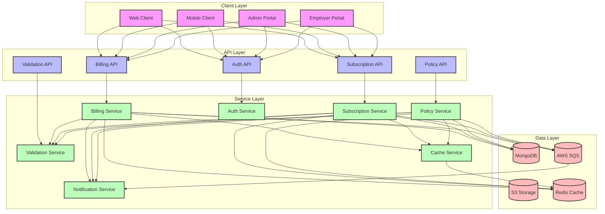
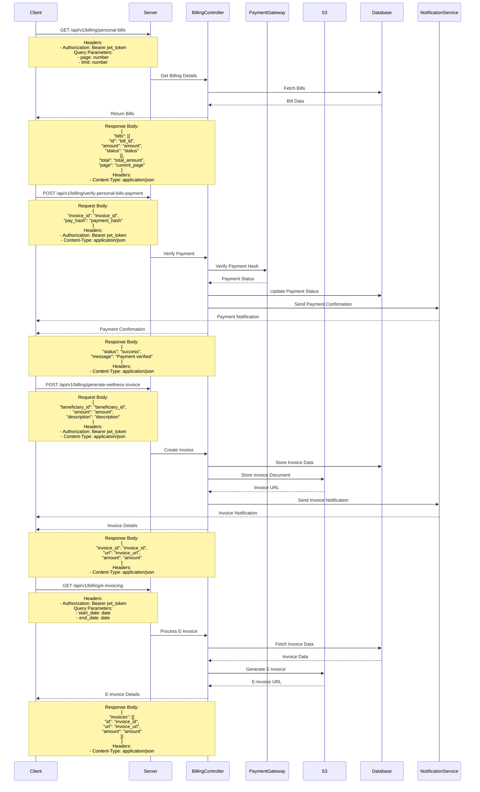

# Billing Flow

## Overview
The billing flow handles subscription management, payment processing, and billing operations.

## High-Level Design



## Sequence Diagram



## API Endpoints

### Personal Bills
```