# Billing Flow

## Overview
The billing flow handles subscription management, payment processing, and billing operations.

## High-Level Design

```mermaid
graph TB
    %% Client Layer
    subgraph ClientLayer[Client Layer]
        Web[Web Client]
        Mobile[Mobile Client]
        AdminPortal[Admin Portal]
        EmployerPortal[Employer Portal]
    end

    %% API Layer
    subgraph APILayer[API Layer]
        BillingAPI[Billing API]
        ValidationAPI[Validation API]
        AuthAPI[Auth API]
        PolicyAPI[Policy API]
        PaymentAPI[Payment API]
        DocumentAPI[Document API]
    end

    %% Service Layer
    subgraph ServiceLayer[Service Layer]
        subgraph CoreServices[Core Services]
            BillingService[Billing Service]
            PolicyService[Policy Service]
            PaymentService[Payment Service]
        end
        
        subgraph InternalServices[Internal Support Services]
            ValidationService[Validation Service]
            AuthService[Auth Service]
            CacheService[Cache Service]
            AuditService[Audit Service]
        end

        subgraph ExternalServices[External Services]
            NotificationService[Notification Service]
            DocumentService[Document Service]
        end
    end

    %% Data Layer
    subgraph DataLayer[Data Layer]
        DB[(MongoDB)]
        S3[(S3 Storage)]
        Cache[(Redis Cache)]
        Queue[(AWS SQS)]
    end

    %% Client to API Connections
    Web --> BillingAPI
    Web --> AuthAPI
    Web --> ValidationAPI
    Web --> PolicyAPI
    Web --> PaymentAPI
    Web --> DocumentAPI
    Mobile --> BillingAPI
    Mobile --> AuthAPI
    Mobile --> ValidationAPI
    Mobile --> PolicyAPI
    Mobile --> PaymentAPI
    Mobile --> DocumentAPI
    AdminPortal --> BillingAPI
    AdminPortal --> AuthAPI
    AdminPortal --> ValidationAPI
    AdminPortal --> PolicyAPI
    AdminPortal --> PaymentAPI
    AdminPortal --> DocumentAPI
    EmployerPortal --> BillingAPI
    EmployerPortal --> AuthAPI
    EmployerPortal --> ValidationAPI
    EmployerPortal --> PolicyAPI
    EmployerPortal --> PaymentAPI
    EmployerPortal --> DocumentAPI

    %% API to Service Connections
    BillingAPI --> BillingService
    ValidationAPI --> ValidationService
    AuthAPI --> AuthService
    PolicyAPI --> PolicyService
    PaymentAPI --> PaymentService
    DocumentAPI --> DocumentService

    %% Core Service Connections
    BillingService --> ValidationService
    BillingService --> NotificationService
    BillingService --> PolicyService
    BillingService --> PaymentService
    BillingService --> CacheService
    BillingService --> DocumentService
    BillingService --> AuditService
    PolicyService --> ValidationService
    PolicyService --> CacheService
    PolicyService --> DocumentService
    PaymentService --> ValidationService
    PaymentService --> CacheService
    PaymentService --> NotificationService
    PaymentService --> AuditService

    %% Service to Data Connections
    BillingService --> DB
    BillingService --> S3
    BillingService --> Queue
    PolicyService --> DB
    PolicyService --> Cache
    PaymentService --> DB
    PaymentService --> Queue
    ValidationService --> DB
    ValidationService --> Cache
    DocumentService --> DB
    DocumentService --> S3
    AuditService --> DB
    AuditService --> S3
    CacheService --> Cache

    %% Styling
    classDef client fill:#f9f,stroke:#333,stroke-width:2px
    classDef api fill:#bbf,stroke:#333,stroke-width:2px
    classDef coreService fill:#bfb,stroke:#333,stroke-width:2px
    classDef internalService fill:#fbb,stroke:#333,stroke-width:2px
    classDef externalService fill:#ff9,stroke:#333,stroke-width:2px
    classDef data fill:#ddd,stroke:#333,stroke-width:2px

    class Web,Mobile,AdminPortal,EmployerPortal client
    class BillingAPI,ValidationAPI,AuthAPI,PolicyAPI,PaymentAPI,DocumentAPI api
    class BillingService,PolicyService,PaymentService coreService
    class ValidationService,AuthService,CacheService,AuditService internalService
    class NotificationService,DocumentService externalService
    class DB,S3,Cache,Queue data
```



## Sequence Diagram

```mermaid
sequenceDiagram
    participant Client
    participant Server
    participant BillingController
    participant ValidationService
    participant PolicyService
    participant PaymentService
    participant Database
    participant NotificationService
    participant DocumentService
    participant AuditService

    %% Generate Invoice Flow
    Client->>Server: POST /api/v1/billing/generate-invoice
    Note over Client,Server: Request Body:<br/>{<br/>  "policy_id": "policy_id",<br/>  "billing_period": "period",<br/>  "payment_method": "method"<br/>}<br/>Headers:<br/>- Authorization: Bearer jwt_token<br/>- Content-Type: application/json
    Server->>BillingController: Generate Invoice
    BillingController->>ValidationService: Validate Request
    ValidationService-->>BillingController: Validation Result
    BillingController->>PolicyService: Get Policy Details
    PolicyService-->>BillingController: Policy Data
    BillingController->>Database: Create Invoice
    Database-->>BillingController: Invoice Created
    BillingController->>DocumentService: Generate Invoice Document
    DocumentService-->>BillingController: Document Generated
    BillingController->>NotificationService: Send Invoice Notification
    NotificationService-->>Client: Invoice Notification
    BillingController->>AuditService: Log Invoice Generation
    AuditService-->>BillingController: Audit Log Created
    BillingController-->>Client: Invoice Details
    Note over BillingController,Client: Response Body:<br/>{<br/>  "invoice_id": "invoice_id",<br/>  "amount": "amount",<br/>  "due_date": "date",<br/>  "document_url": "url"<br/>}

    %% Process Payment Flow
    Client->>Server: POST /api/v1/billing/process-payment
    Note over Client,Server: Request Body:<br/>{<br/>  "invoice_id": "invoice_id",<br/>  "payment_details": {<br/>    "method": "method",<br/>    "amount": "amount"<br/>  }<br/>}<br/>Headers:<br/>- Authorization: Bearer jwt_token<br/>- Content-Type: application/json
    Server->>BillingController: Process Payment
    BillingController->>ValidationService: Validate Request
    ValidationService-->>BillingController: Validation Result
    BillingController->>PaymentService: Process Payment
    PaymentService-->>BillingController: Payment Confirmation
    BillingController->>Database: Update Invoice Status
    Database-->>BillingController: Status Updated
    BillingController->>DocumentService: Generate Receipt
    DocumentService-->>BillingController: Receipt Generated
    BillingController->>NotificationService: Send Payment Confirmation
    NotificationService-->>Client: Payment Confirmation
    BillingController->>AuditService: Log Payment
    AuditService-->>BillingController: Audit Log Created
    BillingController-->>Client: Payment Status
    Note over BillingController,Client: Response Body:<br/>{<br/>  "payment_id": "payment_id",<br/>  "status": "status",<br/>  "receipt_url": "url",<br/>  "message": "payment_message"<br/>}

    %% Get Invoice Details Flow
    Client->>Server: GET /api/v1/billing/invoice/:id
    Note over Client,Server: Headers:<br/>- Authorization: Bearer jwt_token
    Server->>BillingController: Get Invoice
    BillingController->>ValidationService: Validate Request
    ValidationService-->>BillingController: Validation Result
    BillingController->>Database: Fetch Invoice
    Database-->>BillingController: Invoice Data
    BillingController-->>Client: Invoice Details
    Note over BillingController,Client: Response Body:<br/>{<br/>  "invoice_id": "invoice_id",<br/>  "amount": "amount",<br/>  "status": "status",<br/>  "due_date": "date",<br/>  "payment_history": ["payment_details"]<br/>}

    %% Get Billing History Flow
    Client->>Server: GET /api/v1/billing/history
    Note over Client,Server: Headers:<br/>- Authorization: Bearer jwt_token<br/>Query Parameters:<br/>- start_date: date<br/>- end_date: date<br/>- status: string
    Server->>BillingController: Get History
    BillingController->>ValidationService: Validate Request
    ValidationService-->>BillingController: Validation Result
    BillingController->>Database: Fetch History
    Database-->>BillingController: History Data
    BillingController-->>Client: Billing History
    Note over BillingController,Client: Response Body:<br/>{<br/>  "invoices": [{<br/>    "invoice_id": "invoice_id",<br/>    "amount": "amount",<br/>    "status": "status",<br/>    "date": "date"<br/>  }]<br/>}

    %% Update Payment Method Flow
    Client->>Server: PUT /api/v1/billing/payment-method
    Note over Client,Server: Request Body:<br/>{<br/>  "policy_id": "policy_id",<br/>  "payment_method": {<br/>    "type": "type",<br/>    "details": "details"<br/>  }<br/>}<br/>Headers:<br/>- Authorization: Bearer jwt_token<br/>- Content-Type: application/json
    Server->>BillingController: Update Payment Method
    BillingController->>ValidationService: Validate Request
    ValidationService-->>BillingController: Validation Result
    BillingController->>PaymentService: Update Method
    PaymentService-->>BillingController: Method Updated
    BillingController->>Database: Update Method
    Database-->>BillingController: Method Updated
    BillingController->>NotificationService: Send Method Update
    NotificationService-->>Client: Method Update Notification
    BillingController->>AuditService: Log Method Update
    AuditService-->>BillingController: Audit Log Created
    BillingController-->>Client: Update Status
    Note over BillingController,Client: Response Body:<br/>{<br/>  "status": "status",<br/>  "message": "update_message"<br/>}
```



## API Endpoints

### Generate Invoice
```http
POST /api/v1/billing/generate-invoice
Content-Type: application/json
Authorization: Bearer <jwt_token>

{
    "policy_id": "string",
    "billing_period": "string",
    "payment_method": "string"
}
```

### Process Payment
```http
POST /api/v1/billing/process-payment
Content-Type: application/json
Authorization: Bearer <jwt_token>

{
    "invoice_id": "string",
    "payment_details": {
        "method": "string",
        "amount": "number"
    }
}
```

### Get Invoice Details
```http
GET /api/v1/billing/invoice/:id
Authorization: Bearer <jwt_token>
```

### Get Billing History
```http
GET /api/v1/billing/history
Authorization: Bearer <jwt_token>
Query Parameters:
- start_date: date (optional)
- end_date: date (optional)
- status: string (optional)
```

### Update Payment Method
```http
PUT /api/v1/billing/payment-method
Content-Type: application/json
Authorization: Bearer <jwt_token>

{
    "policy_id": "string",
    "payment_method": {
        "type": "string",
        "details": "object"
    }
}
```

### Get Payment Methods
```http
GET /api/v1/billing/payment-methods
Authorization: Bearer <jwt_token>
```

### Get Billing Summary
```http
GET /api/v1/billing/summary
Authorization: Bearer <jwt_token>
Query Parameters:
- period: string (optional)
- policy_id: string (optional)
```