# Claim Support Flow

## Overview
The claim support flow manages the processing, validation, and resolution of insurance claims in the EmployeeSure system.

## High-Level Design

```mermaid
graph TB
    %% Client Layer
    subgraph ClientLayer[Client Layer]
        Web[Web Client]
        Mobile[Mobile Client]
        AdminPortal[Admin Portal]
        EmployerPortal[Employer Portal]
        HospitalPortal[Hospital Portal]
    end

    %% API Layer
    subgraph APILayer[API Layer]
        ClaimAPI[Claim API]
        ValidationAPI[Validation API]
        AuthAPI[Auth API]
        SupportAPI[Support API]
        HospitalAPI[Hospital API]
        PaymentAPI[Payment API]
        DocumentAPI[Document API]
    end

    %% Service Layer
    subgraph ServiceLayer[Service Layer]
        subgraph CoreServices[Core Services]
            ClaimService[Claim Service]
            SupportService[Support Service]
            PolicyService[Policy Service]
            HospitalService[Hospital Service]
        end
        
        subgraph InternalServices[Internal Services]
            ValidationService[Validation Service]
            AuthService[Auth Service]
            CacheService[Cache Service]
            AuditService[Audit Service]
        end

        subgraph ExternalServices[External Services]
            NotificationService[Notification Service]
            DocumentService[Document Service]
            PaymentService[Payment Service]
            ReportService[Report Service]
        end
    end

    %% Data Layer
    subgraph DataLayer[Data Layer]
        DB[(MongoDB)]
        S3[(S3 Storage)]
        Cache[(Redis Cache)]
        Queue[(AWS SQS)]
    end

    %% Client to API Connections
    Web --> ClaimAPI
    Web --> AuthAPI
    Web --> HospitalAPI
    Web --> PaymentAPI
    Web --> ValidationAPI
    Mobile --> ClaimAPI
    Mobile --> AuthAPI
    Mobile --> HospitalAPI
    Mobile --> PaymentAPI
    Mobile --> ValidationAPI
    AdminPortal --> ClaimAPI
    AdminPortal --> AuthAPI
    AdminPortal --> HospitalAPI
    AdminPortal --> PaymentAPI
    AdminPortal --> ValidationAPI
    EmployerPortal --> ClaimAPI
    EmployerPortal --> AuthAPI
    EmployerPortal --> HospitalAPI
    EmployerPortal --> PaymentAPI
    EmployerPortal --> ValidationAPI
    HospitalPortal --> ClaimAPI
    HospitalPortal --> AuthAPI
    HospitalPortal --> HospitalAPI
    HospitalPortal --> PaymentAPI
    HospitalPortal --> ValidationAPI

    %% API to Service Connections
    ClaimAPI --> ClaimService
    ValidationAPI --> ValidationService
    AuthAPI --> AuthService
    SupportAPI --> SupportService
    HospitalAPI --> HospitalService
    PaymentAPI --> PaymentService
    DocumentAPI --> DocumentService

    %% Core Service to Validation API Connections
    ClaimService --> ValidationAPI
    SupportService --> ValidationAPI
    PolicyService --> ValidationAPI
    HospitalService --> ValidationAPI

    %% Core Service Connections
    ClaimService --> NotificationService
    ClaimService --> PolicyService
    ClaimService --> DocumentService
    ClaimService --> CacheService
    ClaimService --> AuditService
    SupportService --> NotificationService
    SupportService --> CacheService
    SupportService --> AuditService
    PolicyService --> CacheService
    PolicyService --> AuditService
    HospitalService --> CacheService
    HospitalService --> AuditService

    %% Internal Service Connections
    ValidationService --> AuthService
    ValidationService --> CacheService
    ValidationService --> AuditService
    AuthService --> CacheService
    AuthService --> AuditService
    CacheService --> AuditService

    %% External Service Connections
    NotificationService --> DocumentService
    DocumentService --> PaymentService
    PaymentService --> ReportService

    %% Service to Data Connections
    ClaimService --> DB
    ClaimService --> S3
    ClaimService --> Queue
    SupportService --> DB
    SupportService --> Queue
    PolicyService --> DB
    PolicyService --> Cache
    HospitalService --> DB
    HospitalService --> Cache
    ValidationService --> DB
    ValidationService --> Cache
    DocumentService --> DB
    DocumentService --> S3
    PaymentService --> DB
    PaymentService --> Queue
    CacheService --> Cache
    AuditService --> DB
    AuditService --> S3

    %% Styling
    classDef client fill:#f9f,stroke:#333,stroke-width:2px
    classDef api fill:#bbf,stroke:#333,stroke-width:2px
    classDef coreService fill:#bfb,stroke:#333,stroke-width:2px
    classDef internalService fill:#fbb,stroke:#333,stroke-width:2px
    classDef externalService fill:#ff9,stroke:#333,stroke-width:2px
    classDef data fill:#ddd,stroke:#333,stroke-width:2px

    class Web,Mobile,AdminPortal,EmployerPortal,HospitalPortal client
    class ClaimAPI,ValidationAPI,AuthAPI,SupportAPI,HospitalAPI,PaymentAPI,DocumentAPI api
    class ClaimService,SupportService,PolicyService,HospitalService coreService
    class ValidationService,AuthService,CacheService,AuditService internalService
    class NotificationService,DocumentService,PaymentService,ReportService externalService
    class DB,S3,Cache,Queue data
```



## Sequence Diagram

```mermaid
sequenceDiagram
    participant Client
    participant Server
    participant ClaimController
    participant HospitalController
    participant ValidationService
    participant Database
    participant NotificationService
    participant PaymentService
    participant DocumentService
    participant AuditService

    %% Claim Submission Flow
    Client->>Server: POST /api/v1/claim/submit
    Note over Client,Server: Request Body:<br/>{<br/>  "policy_id": "policy_id",<br/>  "hospital_id": "hospital_id",<br/>  "treatment_type": "treatment_type",<br/>  "amount": "amount",<br/>  "documents": ["document_urls"]<br/>}<br/>Headers:<br/>- Authorization: Bearer jwt_token<br/>- Content-Type: application/json
    Server->>ClaimController: Submit Claim
    ClaimController->>ValidationService: Validate Request
    ValidationService-->>ClaimController: Validation Result
    ClaimController->>HospitalController: Validate Hospital
    HospitalController-->>ClaimController: Hospital Validation
    ClaimController->>Database: Store Claim
    ClaimController->>DocumentService: Store Documents
    DocumentService-->>ClaimController: Document Confirmation
    ClaimController->>AuditService: Log Claim Submission
    AuditService-->>ClaimController: Audit Confirmation
    ClaimController->>NotificationService: Send Claim Notification
    NotificationService-->>Client: Claim Submission Notification
    ClaimController-->>Client: Claim Details
    Note over ClaimController,Client: Response Body:<br/>{<br/>  "claim_id": "claim_id",<br/>  "status": "status",<br/>  "document_urls": ["urls"],<br/>  "message": "submission_message"<br/>}<br/>Headers:<br/>- Content-Type: application/json

    %% Claim Verification Flow
    Client->>Server: POST /api/v1/claim/:id/verify
    Note over Client,Server: Request Body:<br/>{<br/>  "verification_status": "status",<br/>  "verification_notes": "notes"<br/>}<br/>Headers:<br/>- Authorization: Bearer jwt_token<br/>- Content-Type: application/json
    Server->>ClaimController: Verify Claim
    ClaimController->>ValidationService: Validate Request
    ValidationService-->>ClaimController: Validation Result
    ClaimController->>Database: Update Claim Status
    Database-->>ClaimController: Update Confirmation
    ClaimController->>AuditService: Log Verification
    AuditService-->>ClaimController: Audit Confirmation
    ClaimController->>NotificationService: Send Verification Notification
    NotificationService-->>Client: Verification Notification
    ClaimController-->>Client: Verification Status
    Note over ClaimController,Client: Response Body:<br/>{<br/>  "claim_id": "claim_id",<br/>  "verification_status": "status",<br/>  "message": "verification_message"<br/>}<br/>Headers:<br/>- Content-Type: application/json

    %% Claim Settlement Flow
    Client->>Server: POST /api/v1/claim/:id/settle
    Note over Client,Server: Request Body:<br/>{<br/>  "settlement_amount": "amount",<br/>  "settlement_notes": "notes"<br/>}<br/>Headers:<br/>- Authorization: Bearer jwt_token<br/>- Content-Type: application/json
    Server->>ClaimController: Settle Claim
    ClaimController->>ValidationService: Validate Request
    ValidationService-->>ClaimController: Validation Result
    ClaimController->>PaymentService: Process Payment
    PaymentService-->>ClaimController: Payment Confirmation
    ClaimController->>Database: Update Settlement Status
    ClaimController->>AuditService: Log Settlement
    AuditService-->>ClaimController: Audit Confirmation
    ClaimController->>NotificationService: Send Settlement Notification
    NotificationService-->>Client: Settlement Notification
    ClaimController-->>Client: Settlement Status
    Note over ClaimController,Client: Response Body:<br/>{<br/>  "claim_id": "claim_id",<br/>  "settlement_status": "status",<br/>  "settlement_amount": "amount",<br/>  "message": "settlement_message"<br/>}<br/>Headers:<br/>- Content-Type: application/json

    %% Claim Status Flow
    Client->>Server: GET /api/v1/claim/:id/status
    Note over Client,Server: Headers:<br/>- Authorization: Bearer jwt_token
    Server->>ClaimController: Get Claim Status
    ClaimController->>ValidationService: Validate Request
    ValidationService-->>ClaimController: Validation Result
    ClaimController->>Database: Fetch Claim Data
    Database-->>ClaimController: Claim Data
    ClaimController-->>Client: Claim Status
    Note over ClaimController,Client: Response Body:<br/>{<br/>  "claim_id": "claim_id",<br/>  "status": "status",<br/>  "treatment_type": "type",<br/>  "amount": "amount",<br/>  "verification_status": "status",<br/>  "settlement_status": "status"<br/>}<br/>Headers:<br/>- Content-Type: application/json

    %% Hospital Registration Flow
    Client->>Server: POST /api/v1/hospital/register
    Note over Client,Server: Request Body:<br/>{<br/>  "name": "name",<br/>  "address": "address",<br/>  "contact": "contact",<br/>  "documents": ["document_urls"]<br/>}<br/>Headers:<br/>- Authorization: Bearer jwt_token<br/>- Content-Type: application/json
    Server->>HospitalController: Register Hospital
    HospitalController->>ValidationService: Validate Request
    ValidationService-->>HospitalController: Validation Result
    HospitalController->>Database: Store Hospital
    HospitalController->>DocumentService: Store Documents
    DocumentService-->>HospitalController: Document Confirmation
    HospitalController->>AuditService: Log Registration
    AuditService-->>HospitalController: Audit Confirmation
    HospitalController->>NotificationService: Send Registration Notification
    NotificationService-->>Client: Registration Notification
    HospitalController-->>Client: Hospital Details
    Note over HospitalController,Client: Response Body:<br/>{<br/>  "hospital_id": "hospital_id",<br/>  "status": "status",<br/>  "document_urls": ["urls"],<br/>  "message": "registration_message"<br/>}<br/>Headers:<br/>- Content-Type: application/json
```



## API Endpoints

### Claim Submission
```http
POST /api/v1/claim/submit
Content-Type: application/json
Authorization: Bearer <jwt_token>

{
    "policy_id": "string",
    "hospital_id": "string",
    "treatment_type": "string",
    "amount": "number",
    "documents": ["string"]
}
```

### Claim Verification
```http
POST /api/v1/claim/:id/verify
Content-Type: application/json
Authorization: Bearer <jwt_token>

{
    "verification_status": "string",
    "verification_notes": "string"
}
```

### Claim Settlement
```http
POST /api/v1/claim/:id/settle
Content-Type: application/json
Authorization: Bearer <jwt_token>

{
    "settlement_amount": "number",
    "settlement_notes": "string"
}
```

### Claim Status
```http
GET /api/v1/claim/:id/status
Authorization: Bearer <jwt_token>
```

### Hospital Registration
```http
POST /api/v1/hospital/register
Content-Type: application/json
Authorization: Bearer <jwt_token>

{
    "name": "string",
    "address": "string",
    "contact": "string",
    "documents": ["string"]
}
```

## Data Models

### Claim Model
```javascript
{
    id: String,
    policy_id: String,
    hospital_id: String,
    treatment_type: String,
    amount: Number,
    status: String,
    verification_status: String,
    verification_notes: String,
    settlement_status: String,
    settlement_amount: Number,
    settlement_notes: String,
    documents: [String],
    created_at: Date,
    updated_at: Date
}
```

## Security Considerations

1. **Access Control**
   - Role-based access control for claim management
   - Document encryption
   - Secure payment processing
   - Audit logging

2. **Data Validation**
   - Claim data validation
   - Document validation
   - Payment validation

## Error Handling

### Common Error Codes
- 400: Bad Request - Invalid claim data
- 401: Unauthorized - Invalid token
- 403: Forbidden - Insufficient permissions
- 404: Not Found - Claim not found
- 409: Conflict - Claim already exists
- 422: Unprocessable Entity - Invalid payment data
- 500: Internal Server Error - Server-side issues

### Error Response Format
```javascript
{
    "status": "error",
    "code": "ERROR_CODE",
    "message": "Error description",
    "details": {
        "field": "error_details"
    }
}
```

## Integration Points

1. **Hospital Service**
   - Hospital validation
   - Treatment verification
   - Network status check

2. **Payment Service**
   - Payment processing
   - Transaction tracking

3. **Document Service**
   - Document storage
   - Document verification
   - Document retrieval

4. **Notification Service**
   - Claim submission notifications
   - Verification notifications
   - Settlement notifications
   - Status updates

## Best Practices

1. **Claim Management**
   - Regular status checks
   - Automated verification
   - Payment tracking
   - Document management

2. **Data Management**
   - Regular data backups
   - Audit logging
   - Data retention policies
   - Privacy compliance

3. **Performance**
   - Caching frequently accessed claims
   - Optimized database queries
   - Efficient document handling

4. **Monitoring**
   - Track claim submission rates
   - Monitor verification success rates
   - Track settlement processing
   - Alert on claim issues