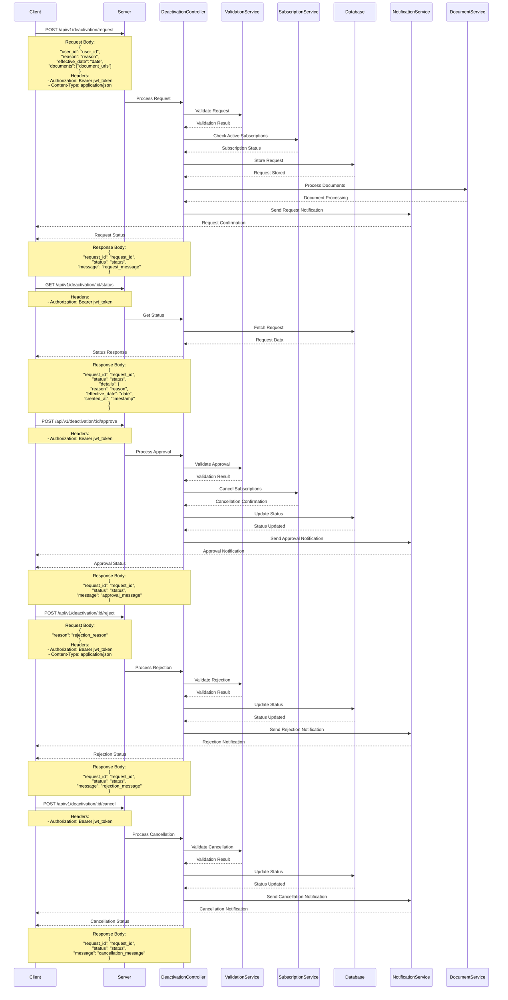

# Deactivation Flow

## Overview
The deactivation flow manages the process of deactivating users, subscriptions, and policies in the EmployeeSure system.

## High-Level Design

```mermaid
graph TB
    %% Client Layer
    subgraph ClientLayer[Client Layer]
        Web[Web Client]
        Mobile[Mobile Client]
        AdminPortal[Admin Portal]
        EmployerPortal[Employer Portal]
    end

    %% API Layer
    subgraph APILayer[API Layer]
        DeactivationAPI[Deactivation API]
        ValidationAPI[Validation API]
        AuthAPI[Auth API]
        PolicyAPI[Policy API]
        BillingAPI[Billing API]
        DocumentAPI[Document API]
    end

    %% Service Layer
    subgraph ServiceLayer[Service Layer]
        subgraph CoreServices[Core Services]
            DeactivationService[Deactivation Service]
            PolicyService[Policy Service]
            BillingService[Billing Service]
        end
        
        subgraph InternalServices[Internal Support Services]
            ValidationService[Validation Service]
            AuthService[Auth Service]
            CacheService[Cache Service]
            AuditService[Audit Service]
        end

        subgraph ExternalServices[External Services]
            NotificationService[Notification Service]
            DocumentService[Document Service]
            PaymentService[Payment Service]
        end
    end

    %% Data Layer
    subgraph DataLayer[Data Layer]
        DB[(MongoDB)]
        S3[(S3 Storage)]
        Cache[(Redis Cache)]
        Queue[(AWS SQS)]
    end

    %% Client to API Connections
    Web --> DeactivationAPI
    Web --> AuthAPI
    Web --> ValidationAPI
    Web --> PolicyAPI
    Web --> BillingAPI
    Web --> DocumentAPI
    Mobile --> DeactivationAPI
    Mobile --> AuthAPI
    Mobile --> ValidationAPI
    Mobile --> PolicyAPI
    Mobile --> BillingAPI
    Mobile --> DocumentAPI
    AdminPortal --> DeactivationAPI
    AdminPortal --> AuthAPI
    AdminPortal --> ValidationAPI
    AdminPortal --> PolicyAPI
    AdminPortal --> BillingAPI
    AdminPortal --> DocumentAPI
    EmployerPortal --> DeactivationAPI
    EmployerPortal --> AuthAPI
    EmployerPortal --> ValidationAPI
    EmployerPortal --> PolicyAPI
    EmployerPortal --> BillingAPI
    EmployerPortal --> DocumentAPI

    %% API to Service Connections
    DeactivationAPI --> DeactivationService
    ValidationAPI --> ValidationService
    AuthAPI --> AuthService
    PolicyAPI --> PolicyService
    BillingAPI --> BillingService
    DocumentAPI --> DocumentService

    %% Core Service Connections
    DeactivationService --> ValidationService
    DeactivationService --> NotificationService
    DeactivationService --> PolicyService
    DeactivationService --> BillingService
    DeactivationService --> CacheService
    DeactivationService --> DocumentService
    DeactivationService --> AuditService
    DeactivationService --> PaymentService
    PolicyService --> ValidationService
    PolicyService --> CacheService
    PolicyService --> DocumentService
    PolicyService --> AuditService
    BillingService --> ValidationService
    BillingService --> CacheService
    BillingService --> NotificationService
    BillingService --> AuditService
    BillingService --> PaymentService

    %% Service to Data Connections
    DeactivationService --> DB
    DeactivationService --> Queue
    PolicyService --> DB
    PolicyService --> Cache
    BillingService --> DB
    BillingService --> Queue
    ValidationService --> DB
    ValidationService --> Cache
    DocumentService --> DB
    DocumentService --> S3
    AuditService --> DB
    AuditService --> S3
    CacheService --> Cache

    %% Styling
    classDef client fill:#f9f,stroke:#333,stroke-width:2px
    classDef api fill:#bbf,stroke:#333,stroke-width:2px
    classDef coreService fill:#bfb,stroke:#333,stroke-width:2px
    classDef internalService fill:#fbb,stroke:#333,stroke-width:2px
    classDef externalService fill:#ff9,stroke:#333,stroke-width:2px
    classDef data fill:#ddd,stroke:#333,stroke-width:2px

    class Web,Mobile,AdminPortal,EmployerPortal client
    class DeactivationAPI,ValidationAPI,AuthAPI,PolicyAPI,BillingAPI,DocumentAPI api
    class DeactivationService,PolicyService,BillingService coreService
    class ValidationService,AuthService,CacheService,AuditService internalService
    class NotificationService,DocumentService,PaymentService externalService
    class DB,S3,Cache,Queue data
```



## Sequence Diagram



## API Endpoints

### Request Deactivation
```http
POST /api/v1/deactivation/request
Content-Type: application/json
Authorization: Bearer <jwt_token>

{
    "user_id": "string",
    "reason": "string",
    "effective_date": "date",
    "documents": ["string"]
}
```

### Approve Deactivation
```http
POST /api/v1/deactivation/:id/approve
Authorization: Bearer <jwt_token>
```

### Reject Deactivation
```http
POST /api/v1/deactivation/:id/reject
Content-Type: application/json
Authorization: Bearer <jwt_token>

{
    "reason": "string"
}
```

### Get Deactivation Status
```http
GET /api/v1/deactivation/:id/status
Authorization: Bearer <jwt_token>
```

### List Deactivation Requests
```http
GET /api/v1/deactivation/requests
Authorization: Bearer <jwt_token>
Query Parameters:
- status: string (optional)
- user_id: string (optional)
- start_date: date (optional)
- end_date: date (optional)
```

### Cancel Deactivation Request
```http
POST /api/v1/deactivation/:id/cancel
Authorization: Bearer <jwt_token>
```

## Data Models

### Deactivation Request
```javascript
{
    request_id: String,
    reason: String,
    one_time_password: String,
    value: Array,
    created_at: Date,
    updated_at: Date
}
```

### Deactivation Log
```javascript
{
    deactivation_id: String,
    user_id: String,
    type: String,
    reason: String,
    status: String,
    created_at: Date,
    updated_at: Date
}
```

## Security Considerations

1. **OTP Verification**
   - OTP generation and validation
   - OTP expiration handling
   - Rate limiting on OTP requests

2. **Access Control**
   - Role-based access control
   - Permission validation
   - Audit logging

3. **Data Security**
   - Secure data transmission
   - Data encryption
   - Session management

4. **API Security**
   - Rate limiting
   - Input validation
   - Error handling

## Error Handling

### Common Error Codes
- 400: Bad Request - Invalid input
- 401: Unauthorized - Invalid OTP
- 403: Forbidden - Insufficient permissions
- 429: Too Many Requests - Rate limit exceeded
- 500: Internal Server Error - Server-side issues

### Error Response Format
```javascript
{
    "status": "error",
    "code": "ERROR_CODE",
    "message": "Error description",
    "details": {} // Optional additional details
}
```

## Integration Points

1. **Payment System**
   - Payment deactivation
   - Refund processing
   - Payment status updates

2. **Notification System**
   - OTP delivery
   - Deactivation notifications
   - Status updates

3. **Cache System**
   - Session management
   - Data caching
   - Cache invalidation

4. **Activity Logging**
   - Audit trails
   - Activity tracking
   - Log management

## Best Practices

1. **Deactivation Process**
   - Validate all dependencies
   - Handle partial deactivations
   - Maintain data consistency

2. **Security**
   - Implement proper authentication
   - Use secure communication
   - Follow security guidelines

3. **Performance**
   - Optimize database queries
   - Use caching effectively
   - Handle concurrent requests

4. **Monitoring**
   - Track deactivation metrics
   - Monitor system performance
   - Log important events
``` 