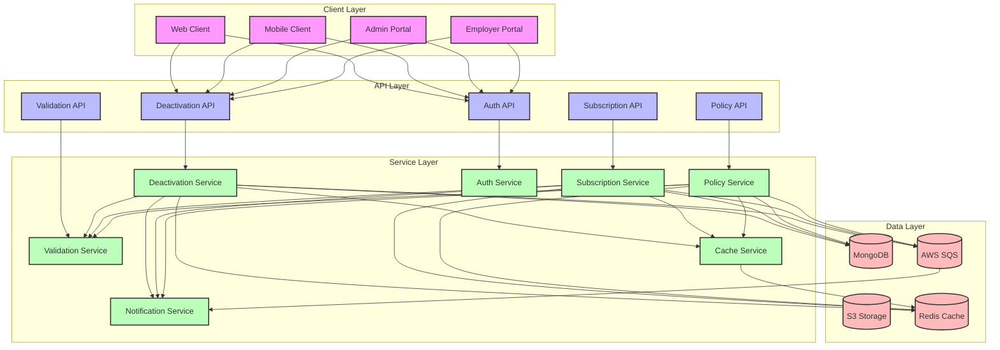
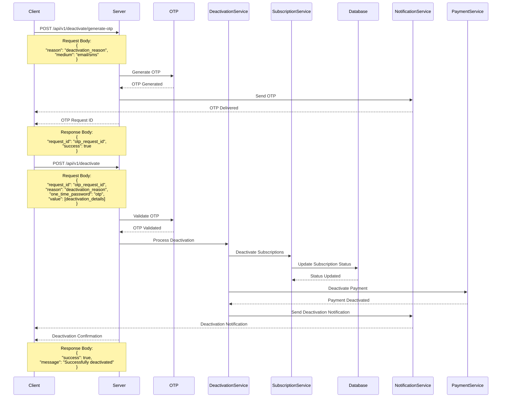

# Deactivation Flow

## Overview
The deactivation flow manages the process of deactivating users, subscriptions, and employers in the EmployeeSure system. This includes handling various types of deactivations, security measures, and associated business logic.

## High-Level Design



## Sequence Diagram



## API Endpoints

### Generate OTP
```http
POST /api/v1/deactivate/generate-otp
Content-Type: application/json

{
    "reason": "deactivation_reason",
    "medium": "email/sms"
}
```

### Deactivate
```http
POST /api/v1/deactivate
Content-Type: application/json

{
    "request_id": "otp_request_id",
    "reason": "deactivation_reason",
    "one_time_password": "otp",
    "value": [
        {
            "id": "user_id",
            "type": "user_type"
        }
    ]
}
```

## Data Models

### Deactivation Request
```javascript
{
    request_id: String,
    reason: String,
    one_time_password: String,
    value: Array,
    created_at: Date,
    updated_at: Date
}
```

### Deactivation Log
```javascript
{
    deactivation_id: String,
    user_id: String,
    type: String,
    reason: String,
    status: String,
    created_at: Date,
    updated_at: Date
}
```

## Security Considerations

1. **OTP Verification**
   - OTP generation and validation
   - OTP expiration handling
   - Rate limiting on OTP requests

2. **Access Control**
   - Role-based access control
   - Permission validation
   - Audit logging

3. **Data Security**
   - Secure data transmission
   - Data encryption
   - Session management

4. **API Security**
   - Rate limiting
   - Input validation
   - Error handling

## Error Handling

### Common Error Codes
- 400: Bad Request - Invalid input
- 401: Unauthorized - Invalid OTP
- 403: Forbidden - Insufficient permissions
- 429: Too Many Requests - Rate limit exceeded
- 500: Internal Server Error - Server-side issues

### Error Response Format
```javascript
{
    "status": "error",
    "code": "ERROR_CODE",
    "message": "Error description",
    "details": {} // Optional additional details
}
```

## Integration Points

1. **Payment System**
   - Payment deactivation
   - Refund processing
   - Payment status updates

2. **Notification System**
   - OTP delivery
   - Deactivation notifications
   - Status updates

3. **Cache System**
   - Session management
   - Data caching
   - Cache invalidation

4. **Activity Logging**
   - Audit trails
   - Activity tracking
   - Log management

## Best Practices

1. **Deactivation Process**
   - Validate all dependencies
   - Handle partial deactivations
   - Maintain data consistency

2. **Security**
   - Implement proper authentication
   - Use secure communication
   - Follow security guidelines

3. **Performance**
   - Optimize database queries
   - Use caching effectively
   - Handle concurrent requests

4. **Monitoring**
   - Track deactivation metrics
   - Monitor system performance
   - Log important events
``` 