# Employer Dashboard Flow

## Overview
The employer dashboard flow manages the employer's view and control of their organization's insurance policies, employees, and claims in the EmployeeSure system.

## High-Level Design

```mermaid
graph TB
    %% Client Layer
    subgraph ClientLayer[Client Layer]
        Web[Web Client]
        Mobile[Mobile Client]
        EmployerPortal[Employer Portal]
    end

    %% API Layer
    subgraph APILayer[API Layer]
        DashboardAPI[Dashboard API]
        ValidationAPI[Validation API]
        AuthAPI[Auth API]
        AnalyticsAPI[Analytics API]
        ReportAPI[Report API]
        EmployeeAPI[Employee API]
        PolicyAPI[Policy API]
    end

    %% Service Layer
    subgraph ServiceLayer[Service Layer]
        subgraph CoreServices[Core Services]
            DashboardService[Dashboard Service]
            AnalyticsService[Analytics Service]
            PolicyService[Policy Service]
            EmployeeService[Employee Service]
        end
        
        subgraph InternalServices[Internal Services]
            ValidationService[Validation Service]
            AuthService[Auth Service]
            CacheService[Cache Service]
            AuditService[Audit Service]
        end

        subgraph ExternalServices[External Services]
            NotificationService[Notification Service]
            ReportService[Report Service]
            DocumentService[Document Service]
            PaymentService[Payment Service]
        end
    end

    %% Data Layer
    subgraph DataLayer[Data Layer]
        DB[(MongoDB)]
        S3[(S3 Storage)]
        Cache[(Redis Cache)]
        Queue[(AWS SQS)]
    end

    %% Client to API Connections
    Web --> DashboardAPI
    Web --> AuthAPI
    Web --> AnalyticsAPI
    Web --> ReportAPI
    Web --> EmployeeAPI
    Web --> PolicyAPI
    Mobile --> DashboardAPI
    Mobile --> AuthAPI
    Mobile --> AnalyticsAPI
    Mobile --> ReportAPI
    Mobile --> EmployeeAPI
    Mobile --> PolicyAPI
    EmployerPortal --> DashboardAPI
    EmployerPortal --> AuthAPI
    EmployerPortal --> AnalyticsAPI
    EmployerPortal --> ReportAPI
    EmployerPortal --> EmployeeAPI
    EmployerPortal --> PolicyAPI

    %% API to Service Connections
    DashboardAPI --> DashboardService
    ValidationAPI --> ValidationService
    AuthAPI --> AuthService
    AnalyticsAPI --> AnalyticsService
    ReportAPI --> ReportService
    EmployeeAPI --> EmployeeService
    PolicyAPI --> PolicyService

    %% Core Service to Validation API Connections
    DashboardService --> ValidationAPI
    AnalyticsService --> ValidationAPI
    PolicyService --> ValidationAPI
    EmployeeService --> ValidationAPI

    %% Core Service Connections
    DashboardService --> ValidationService
    DashboardService --> NotificationService
    DashboardService --> AnalyticsService
    DashboardService --> PolicyService
    DashboardService --> EmployeeService
    DashboardService --> CacheService
    DashboardService --> AuditService
    AnalyticsService --> ValidationService
    AnalyticsService --> CacheService
    AnalyticsService --> ReportService
    AnalyticsService --> AuditService
    PolicyService --> ValidationService
    PolicyService --> CacheService
    PolicyService --> AuditService
    EmployeeService --> ValidationService
    EmployeeService --> CacheService
    EmployeeService --> AuditService

    %% Internal Service Connections
    ValidationService --> AuthService
    ValidationService --> CacheService
    ValidationService --> AuditService
    AuthService --> CacheService
    AuthService --> AuditService
    CacheService --> AuditService

    %% External Service Connections
    NotificationService --> DocumentService
    ReportService --> DocumentService
    DocumentService --> PaymentService

    %% Service to Data Connections
    DashboardService --> DB
    DashboardService --> Cache
    AnalyticsService --> DB
    AnalyticsService --> S3
    AnalyticsService --> Queue
    PolicyService --> DB
    PolicyService --> Cache
    EmployeeService --> DB
    EmployeeService --> Cache
    ValidationService --> DB
    ValidationService --> Cache
    ReportService --> DB
    ReportService --> S3
    CacheService --> Cache
    AuditService --> DB
    AuditService --> S3

    %% Styling
    classDef client fill:#f9f,stroke:#333,stroke-width:2px
    classDef api fill:#bbf,stroke:#333,stroke-width:2px
    classDef coreService fill:#bfb,stroke:#333,stroke-width:2px
    classDef internalService fill:#fbb,stroke:#333,stroke-width:2px
    classDef externalService fill:#ff9,stroke:#333,stroke-width:2px
    classDef data fill:#ddd,stroke:#333,stroke-width:2px

    class Web,Mobile,EmployerPortal client
    class DashboardAPI,ValidationAPI,AuthAPI,AnalyticsAPI,ReportAPI,EmployeeAPI,PolicyAPI api
    class DashboardService,AnalyticsService,PolicyService,EmployeeService coreService
    class ValidationService,AuthService,CacheService,AuditService internalService
    class NotificationService,ReportService,DocumentService,PaymentService externalService
    class DB,S3,Cache,Queue data
```



## Sequence Diagram

```mermaid
sequenceDiagram
    participant Client
    participant Server
    participant DashboardController
    participant PolicyController
    participant EmployeeController
    participant AnalyticsController
    participant ReportController
    participant Database
    participant NotificationService
    participant ValidationService
    participant DocumentService

    %% Dashboard Overview Flow
    Client->>Server: GET /api/v1/dashboard/overview
    Note over Client,Server: Headers:<br/>- Authorization: Bearer jwt_token
    Server->>DashboardController: Get Dashboard Overview
    DashboardController->>ValidationService: Validate Request
    ValidationService-->>DashboardController: Validation Result
    DashboardController->>PolicyController: Get Policy Summary
    PolicyController-->>DashboardController: Policy Data
    DashboardController->>EmployeeController: Get Employee Summary
    EmployeeController-->>DashboardController: Employee Data
    DashboardController->>Database: Fetch Dashboard Data
    Database-->>DashboardController: Dashboard Data
    DashboardController-->>Client: Dashboard Overview
    Note over DashboardController,Client: Response Body:<br/>{<br/>  "total_employees": "count",<br/>  "active_policies": "count",<br/>  "total_premium": "amount",<br/>  "recent_claims": "count"<br/>}<br/>Headers:<br/>- Content-Type: application/json

    %% Employee Management Flow
    Client->>Server: GET /api/v1/employees
    Note over Client,Server: Headers:<br/>- Authorization: Bearer jwt_token
    Server->>EmployeeController: Get Employee Data
    EmployeeController->>ValidationService: Validate Request
    ValidationService-->>EmployeeController: Validation Result
    EmployeeController->>Database: Fetch Employee Data
    Database-->>EmployeeController: Employee Data
    EmployeeController-->>Client: Employee List
    Note over EmployeeController,Client: Response Body:<br/>{<br/>  "employees": [{<br/>    "id": "employee_id",<br/>    "name": "name",<br/>    "status": "status",<br/>    "policy": "policy_details"<br/>  }]<br/>}<br/>Headers:<br/>- Content-Type: application/json

    %% Policy Overview Flow
    Client->>Server: GET /api/v1/policies/overview
    Note over Client,Server: Headers:<br/>- Authorization: Bearer jwt_token
    Server->>PolicyController: Get Policy Overview
    PolicyController->>ValidationService: Validate Request
    ValidationService-->>PolicyController: Validation Result
    PolicyController->>Database: Fetch Policy Data
    Database-->>PolicyController: Policy Data
    PolicyController-->>Client: Policy Overview
    Note over PolicyController,Client: Response Body:<br/>{<br/>  "policies": [{<br/>    "id": "policy_id",<br/>    "type": "type",<br/>    "status": "status",<br/>    "premium": "amount"<br/>  }]<br/>}<br/>Headers:<br/>- Content-Type: application/json

    %% Analytics Overview Flow
    Client->>Server: GET /api/v1/analytics/overview
    Note over Client,Server: Headers:<br/>- Authorization: Bearer jwt_token
    Server->>AnalyticsController: Get Analytics Overview
    AnalyticsController->>ValidationService: Validate Request
    ValidationService-->>AnalyticsController: Validation Result
    AnalyticsController->>Database: Fetch Analytics Data
    Database-->>AnalyticsController: Analytics Data
    AnalyticsController-->>Client: Analytics Overview
    Note over AnalyticsController,Client: Response Body:<br/>{<br/>  "metrics": {<br/>    "claims_by_type": "data",<br/>    "premium_trends": "data",<br/>    "employee_growth": "data"<br/>  }<br/>}<br/>Headers:<br/>- Content-Type: application/json

    %% Report Generation Flow
    Client->>Server: POST /api/v1/reports/generate
    Note over Client,Server: Request Body:<br/>{<br/>  "report_type": "type",<br/>  "date_range": "range",<br/>  "format": "format"<br/>}<br/>Headers:<br/>- Authorization: Bearer jwt_token<br/>- Content-Type: application/json
    Server->>ReportController: Generate Report
    ReportController->>ValidationService: Validate Request
    ValidationService-->>ReportController: Validation Result
    ReportController->>Database: Fetch Report Data
    Database-->>ReportController: Report Data
    ReportController->>DocumentService: Generate Document
    DocumentService-->>ReportController: Document URL
    ReportController->>NotificationService: Send Report Notification
    NotificationService-->>Client: Report Generation Notification
    ReportController-->>Client: Report Data
    Note over ReportController,Client: Response Body:<br/>{<br/>  "report_id": "report_id",<br/>  "status": "status",<br/>  "document_url": "url",<br/>  "message": "generation_message"<br/>}<br/>Headers:<br/>- Content-Type: application/json

    %% Employee Policy Management Flow
    Client->>Server: POST /api/v1/employees/:id/policy
    Note over Client,Server: Request Body:<br/>{<br/>  "policy_id": "policy_id",<br/>  "start_date": "date",<br/>  "beneficiaries": [{<br/>    "name": "name",<br/>    "relationship": "relationship"<br/>  }]<br/>}<br/>Headers:<br/>- Authorization: Bearer jwt_token<br/>- Content-Type: application/json
    Server->>EmployeeController: Update Employee Policy
    EmployeeController->>ValidationService: Validate Request
    ValidationService-->>EmployeeController: Validation Result
    EmployeeController->>PolicyController: Validate Policy
    PolicyController-->>EmployeeController: Policy Validation
    EmployeeController->>Database: Update Employee Policy
    Database-->>EmployeeController: Update Confirmation
    EmployeeController->>NotificationService: Send Policy Update Notification
    NotificationService-->>Client: Policy Update Notification
    EmployeeController-->>Client: Updated Policy
    Note over EmployeeController,Client: Response Body:<br/>{<br/>  "employee_id": "employee_id",<br/>  "policy": "updated_policy",<br/>  "message": "update_message"<br/>}<br/>Headers:<br/>- Content-Type: application/json
```



## API Endpoints

### Dashboard Overview
```http
GET /api/v1/dashboard/overview
Authorization: Bearer <jwt_token>
```

### Employee Management
```http
GET /api/v1/employees
Authorization: Bearer <jwt_token>
```

### Policy Overview
```http
GET /api/v1/policies/overview
Authorization: Bearer <jwt_token>
```

### Analytics Overview
```http
GET /api/v1/analytics/overview
Authorization: Bearer <jwt_token>
```

### Report Generation
```http
POST /api/v1/reports/generate
Content-Type: application/json
Authorization: Bearer <jwt_token>

{
    "report_type": "string",
    "date_range": "string",
    "format": "string"
}
```

### Employee Policy Management
```http
POST /api/v1/employees/:id/policy
Content-Type: application/json
Authorization: Bearer <jwt_token>

{
    "policy_id": "string",
    "start_date": "date",
    "beneficiaries": [
        {
            "name": "string",
            "relationship": "string"
        }
    ]
}
```

## Data Models

### Dashboard Model
```javascript
{
    total_employees: Number,
    active_policies: Number,
    total_premium: Number,
    recent_claims: Number,
    created_at: Date,
    updated_at: Date
}
```

### Employee Model
```javascript
{
    id: String,
    name: String,
    status: String,
    policy: {
        id: String,
        type: String,
        status: String
    },
    created_at: Date,
    updated_at: Date
}
```

### Report Model
```javascript
{
    id: String,
    type: String,
    status: String,
    data: Object,
    created_at: Date,
    updated_at: Date
}
```

## Security Considerations

1. **Access Control**
   - Role-based access control for dashboard access
   - Data encryption
   - Audit logging

2. **Data Validation**
   - Dashboard data validation
   - Report generation validation

## Error Handling

### Common Error Codes
- 400: Bad Request - Invalid request data
- 401: Unauthorized - Invalid token
- 403: Forbidden - Insufficient permissions
- 404: Not Found - Resource not found
- 500: Internal Server Error - Server-side issues

### Error Response Format
```javascript
{
    "status": "error",
    "code": "ERROR_CODE",
    "message": "Error description",
    "details": {
        "field": "error_details"
    }
}
```

## Integration Points

1. **Policy Service**
   - Policy data retrieval
   - Coverage verification
   - Premium calculation

2. **Employee Service**
   - Employee data management
   - Coverage tracking
   - Status updates

3. **Report Service**
   - Report generation
   - Data aggregation
   - Export functionality

4. **Notification Service**
   - Dashboard updates
   - Report notifications
   - Alert notifications

## Best Practices

1. **Dashboard Management**
   - Regular data updates
   - Efficient data aggregation
   - Real-time monitoring
   - Performance optimization

2. **Data Management**
   - Regular data backups
   - Audit logging
   - Data retention policies
   - Privacy compliance

3. **Performance**
   - Caching frequently accessed data
   - Optimized database queries
   - Efficient report generation

4. **Monitoring**
   - Track dashboard usage
   - Monitor report generation
   - Track data updates
   - Alert on system issues