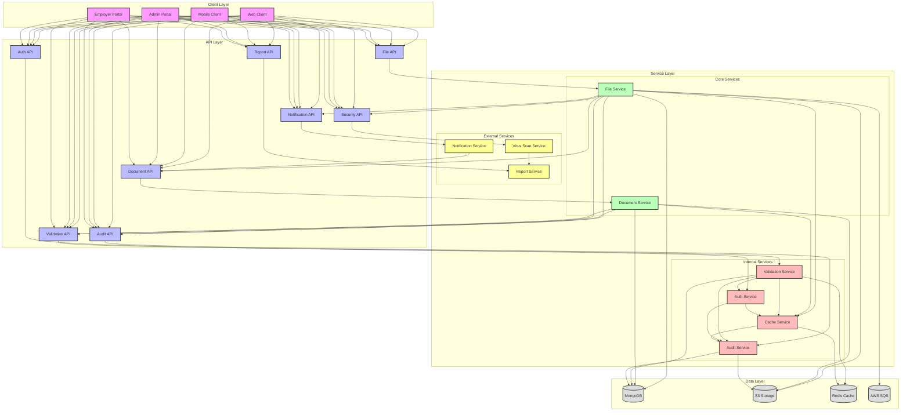

# File Upload Flow

## Overview
The file upload flow manages document uploads, processing, and storage in the EmployeeSure system.

## High-Level Design



## Sequence Diagram

```mermaid
sequenceDiagram
    participant Client
    participant Server
    participant UploadController
    participant ValidationService
    participant DocumentService
    participant Database
    participant S3
    participant NotificationService
    participant VirusScanService
    participant AuditService
    participant ReportService

    %% File Upload Flow
    Client->>Server: POST /api/v1/upload
    Note over Client,Server: Request Body:<br/>{<br/>  "file": "file_data",<br/>  "type": "document_type",<br/>  "metadata": {<br/>    "name": "file_name",<br/>    "size": "file_size",<br/>    "content_type": "mime_type"<br/>  }<br/>}<br/>Headers:<br/>- Authorization: Bearer jwt_token<br/>- Content-Type: multipart/form-data
    Server->>UploadController: Process Upload
    UploadController->>ValidationService: Validate Request
    ValidationService-->>UploadController: Validation Result
    UploadController->>VirusScanService: Scan File
    VirusScanService-->>UploadController: Scan Result
    UploadController->>ReportService: Generate Scan Report
    ReportService-->>UploadController: Scan Report
    UploadController->>S3: Store File
    S3-->>UploadController: Storage Confirmation
    UploadController->>Database: Store File Metadata
    Database-->>UploadController: Metadata Confirmation
    UploadController->>DocumentService: Process Document
    DocumentService-->>UploadController: Processing Result
    UploadController->>AuditService: Log Upload
    AuditService-->>UploadController: Audit Confirmation
    UploadController->>NotificationService: Send Upload Notification
    NotificationService-->>Client: Upload Notification
    UploadController-->>Client: Upload Status
    Note over UploadController,Client: Response Body:<br/>{<br/>  "file_id": "file_id",<br/>  "status": "status",<br/>  "url": "file_url",<br/>  "scan_report": "report_url",<br/>  "message": "upload_message"<br/>}<br/>Headers:<br/>- Content-Type: application/json

    %% File Validation Flow
    Client->>Server: POST /api/v1/files/validate
    Note over Client,Server: Request Body:<br/>{<br/>  "file_id": "file_id",<br/>  "validation_type": "validation_type"<br/>}<br/>Headers:<br/>- Authorization: Bearer jwt_token<br/>- Content-Type: application/json
    Server->>UploadController: Validate File
    UploadController->>ValidationService: Validate File
    ValidationService-->>UploadController: Validation Result
    UploadController->>AuditService: Log Validation
    AuditService-->>UploadController: Audit Confirmation
    UploadController-->>Client: Validation Result
    Note over UploadController,Client: Response Body:<br/>{<br/>  "file_id": "file_id",<br/>  "validation_status": "status",<br/>  "validation_details": "details"<br/>}<br/>Headers:<br/>- Content-Type: application/json

    %% File Scan Flow
    Client->>Server: POST /api/v1/files/scan
    Note over Client,Server: Request Body:<br/>{<br/>  "file_id": "file_id",<br/>  "scan_type": "scan_type"<br/>}<br/>Headers:<br/>- Authorization: Bearer jwt_token<br/>- Content-Type: application/json
    Server->>UploadController: Scan File
    UploadController->>VirusScanService: Scan File
    VirusScanService-->>UploadController: Scan Result
    UploadController->>ReportService: Generate Scan Report
    ReportService-->>UploadController: Scan Report
    UploadController->>AuditService: Log Scan
    AuditService-->>UploadController: Audit Confirmation
    UploadController-->>Client: Scan Result
    Note over UploadController,Client: Response Body:<br/>{<br/>  "file_id": "file_id",<br/>  "scan_status": "status",<br/>  "scan_report": "report_url"<br/>}<br/>Headers:<br/>- Content-Type: application/json

    %% File Retrieval Flow
    Client->>Server: GET /api/v1/files/:id
    Note over Client,Server: Headers:<br/>- Authorization: Bearer jwt_token
    Server->>UploadController: Get File
    UploadController->>ValidationService: Validate Request
    ValidationService-->>UploadController: Validation Result
    UploadController->>Database: Fetch File Metadata
    Database-->>UploadController: File Metadata
    UploadController->>S3: Retrieve File
    S3-->>UploadController: File Data
    UploadController->>AuditService: Log Access
    AuditService-->>UploadController: Audit Confirmation
    UploadController-->>Client: File Data
    Note over UploadController,Client: Response Body:<br/>{<br/>  "file_id": "file_id",<br/>  "url": "file_url",<br/>  "metadata": {<br/>    "name": "file_name",<br/>    "type": "file_type",<br/>    "size": "file_size"<br/>  }<br/>}<br/>Headers:<br/>- Content-Type: application/json

    %% File Update Flow
    Client->>Server: PUT /api/v1/files/:id
    Note over Client,Server: Request Body:<br/>{<br/>  "file": "file_data",<br/>  "metadata": {<br/>    "name": "file_name",<br/>    "type": "file_type"<br/>  }<br/>}<br/>Headers:<br/>- Authorization: Bearer jwt_token<br/>- Content-Type: multipart/form-data
    Server->>UploadController: Update File
    UploadController->>ValidationService: Validate Request
    ValidationService-->>UploadController: Validation Result
    UploadController->>VirusScanService: Scan File
    VirusScanService-->>UploadController: Scan Result
    UploadController->>S3: Update File
    S3-->>UploadController: Update Confirmation
    UploadController->>Database: Update File Metadata
    Database-->>UploadController: Metadata Update
    UploadController->>DocumentService: Update Document
    DocumentService-->>UploadController: Update Result
    UploadController->>AuditService: Log Update
    AuditService-->>UploadController: Audit Confirmation
    UploadController->>NotificationService: Send Update Notification
    NotificationService-->>Client: Update Notification
    UploadController-->>Client: Update Status
    Note over UploadController,Client: Response Body:<br/>{<br/>  "file_id": "file_id",<br/>  "status": "updated_status",<br/>  "url": "updated_url",<br/>  "message": "update_message"<br/>}<br/>Headers:<br/>- Content-Type: application/json

    %% File Delete Flow
    Client->>Server: DELETE /api/v1/files/:id
    Note over Client,Server: Headers:<br/>- Authorization: Bearer jwt_token
    Server->>UploadController: Delete File
    UploadController->>ValidationService: Validate Request
    ValidationService-->>UploadController: Validation Result
    UploadController->>S3: Remove File
    S3-->>UploadController: Deletion Confirmation
    UploadController->>Database: Remove File Metadata
    Database-->>UploadController: Metadata Deletion
    UploadController->>DocumentService: Remove Document
    DocumentService-->>UploadController: Removal Result
    UploadController->>AuditService: Log Deletion
    AuditService-->>UploadController: Audit Confirmation
    UploadController->>NotificationService: Send Deletion Notification
    NotificationService-->>Client: Deletion Notification
    UploadController-->>Client: Deletion Status
    Note over UploadController,Client: Response Body:<br/>{<br/>  "file_id": "file_id",<br/>  "status": "deleted",<br/>  "message": "deletion_message"<br/>}<br/>Headers:<br/>- Content-Type: application/json

    %% File Audit Log Flow
    Client->>Server: GET /api/v1/files/:id/audit
    Note over Client,Server: Headers:<br/>- Authorization: Bearer jwt_token
    Server->>UploadController: Get Audit Log
    UploadController->>ValidationService: Validate Request
    ValidationService-->>UploadController: Validation Result
    UploadController->>AuditService: Get Audit Log
    AuditService-->>UploadController: Audit Log
    UploadController-->>Client: Audit Log
    Note over UploadController,Client: Response Body:<br/>{<br/>  "file_id": "file_id",<br/>  "audit_log": [<br/>    {<br/>      "action": "action",<br/>      "timestamp": "timestamp",<br/>      "user": "user",<br/>      "details": "details"<br/>    }<br/>  ]<br/>}<br/>Headers:<br/>- Content-Type: application/json

    %% File Notifications Flow
    Client->>Server: GET /api/v1/files/:id/notifications
    Note over Client,Server: Headers:<br/>- Authorization: Bearer jwt_token
    Server->>UploadController: Get Notifications
    UploadController->>ValidationService: Validate Request
    ValidationService-->>UploadController: Validation Result
    UploadController->>NotificationService: Get Notifications
    NotificationService-->>UploadController: Notifications
    UploadController-->>Client: Notifications
    Note over UploadController,Client: Response Body:<br/>{<br/>  "file_id": "file_id",<br/>  "notifications": [<br/>    {<br/>      "type": "type",<br/>      "message": "message",<br/>      "timestamp": "timestamp"<br/>    }<br/>  ]<br/>}<br/>Headers:<br/>- Content-Type: application/json

    %% File Scan Report Flow
    Client->>Server: GET /api/v1/files/:id/scan-report
    Note over Client,Server: Headers:<br/>- Authorization: Bearer jwt_token
    Server->>UploadController: Get Scan Report
    UploadController->>ValidationService: Validate Request
    ValidationService-->>UploadController: Validation Result
    UploadController->>ReportService: Get Scan Report
    ReportService-->>UploadController: Scan Report
    UploadController-->>Client: Scan Report
    Note over UploadController,Client: Response Body:<br/>{<br/>  "file_id": "file_id",<br/>  "scan_report": {<br/>    "status": "status",<br/>    "timestamp": "timestamp",<br/>    "details": "details",<br/>    "threats": ["threat1", "threat2"]<br/>  }<br/>}<br/>Headers:<br/>- Content-Type: application/json

    %% File Document Processing Flow
    Client->>Server: POST /api/v1/files/:id/process
    Note over Client,Server: Request Body:<br/>{<br/>  "process_type": "process_type",<br/>  "options": {<br/>    "format": "format",<br/>    "quality": "quality"<br/>  }<br/>}<br/>Headers:<br/>- Authorization: Bearer jwt_token<br/>- Content-Type: application/json
    Server->>UploadController: Process Document
    UploadController->>ValidationService: Validate Request
    ValidationService-->>UploadController: Validation Result
    UploadController->>DocumentService: Process Document
    DocumentService-->>UploadController: Processing Result
    UploadController->>AuditService: Log Processing
    AuditService-->>UploadController: Audit Confirmation
    UploadController-->>Client: Processing Result
    Note over UploadController,Client: Response Body:<br/>{<br/>  "file_id": "file_id",<br/>  "process_status": "status",<br/>  "processed_url": "url",<br/>  "message": "processing_message"<br/>}<br/>Headers:<br/>- Content-Type: application/json
```



## API Endpoints

### File Upload
```http
POST /api/v1/upload
Content-Type: multipart/form-data
Authorization: Bearer <jwt_token>

{
    "file": "file_data",
    "type": "document_type",
    "metadata": {
        "name": "string",
        "size": "number",
        "content_type": "string"
    }
}
```

### File Retrieval
```http
GET /api/v1/files/:id
Authorization: Bearer <jwt_token>
```

### File Update
```http
PUT /api/v1/files/:id
Content-Type: multipart/form-data
Authorization: Bearer <jwt_token>

{
    "file": "file_data",
    "metadata": {
        "name": "string",
        "type": "string"
    }
}
```

### File Delete
```http
DELETE /api/v1/files/:id
Authorization: Bearer <jwt_token>
```

### File Validation
```http
POST /api/v1/files/validate
Content-Type: application/json
Authorization: Bearer <jwt_token>

{
    "file_id": "string",
    "validation_type": "string"
}
```

### File Scan
```http
POST /api/v1/files/scan
Content-Type: application/json
Authorization: Bearer <jwt_token>

{
    "file_id": "string",
    "scan_type": "string"
}
```

### File Audit Log
```http
GET /api/v1/files/:id/audit
Authorization: Bearer <jwt_token>
```

### File Notifications
```http
GET /api/v1/files/:id/notifications
Authorization: Bearer <jwt_token>
```

### File Scan Report
```http
GET /api/v1/files/:id/scan-report
Authorization: Bearer <jwt_token>
```

### File Document Processing
```http
POST /api/v1/files/:id/process
Content-Type: application/json
Authorization: Bearer <jwt_token>

{
    "process_type": "string",
    "options": {
        "format": "string",
        "quality": "string"
    }
}
```