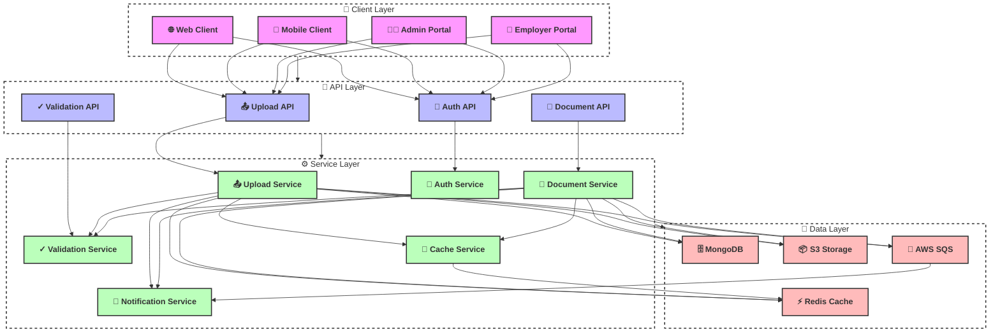
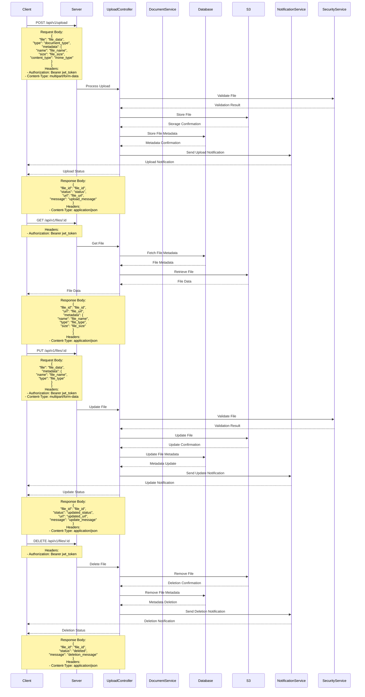

# File Upload Flow

## Overview
The file upload flow in EmployeeSure handles the secure upload, storage, and management of various document types.

## High-Level Design



## Sequence Diagram



## API Endpoints

### File Upload
```