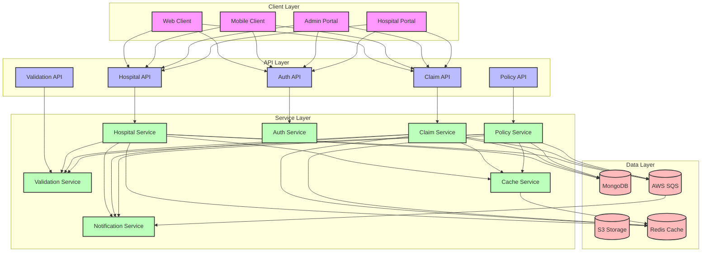
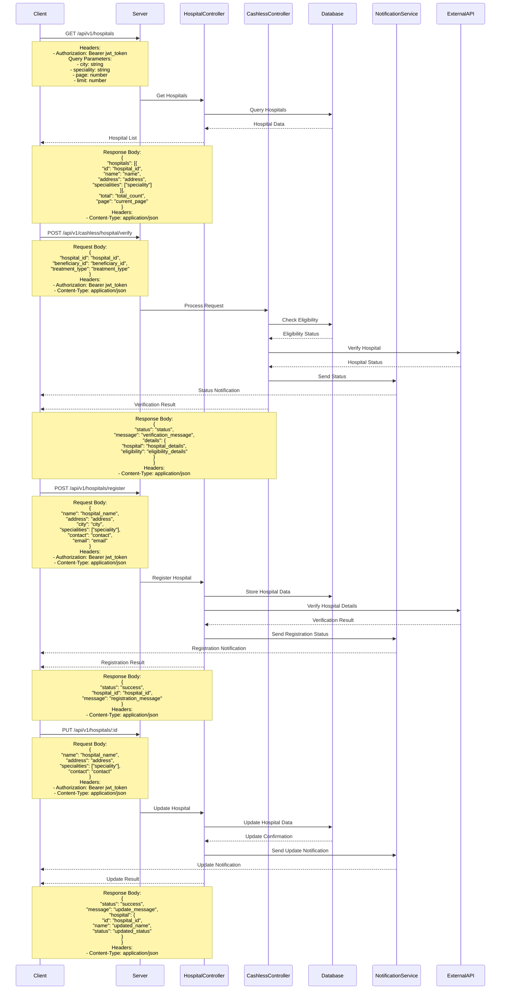

# Hospital Integration Flow

## Overview
The hospital integration flow manages the integration with hospital systems for claim processing and verification.

## High-Level Design



## Sequence Diagram



## API Endpoints

### Hospital Listing
```