# Hospital Integration Flow

## Overview
The hospital integration flow manages the interaction between healthcare providers and the EmployeeSure system for claims processing and coverage verification.

## High-Level Design

```mermaid
graph TB
    %% Client Layer
    subgraph ClientLayer[Client Layer]
        HospitalPortal[Hospital Portal]
        Web[Web Client]
        Mobile[Mobile Client]
    end

    %% API Layer
    subgraph APILayer[API Layer]
        HospitalAPI[Hospital API]
        ValidationAPI[Validation API]
        AuthAPI[Auth API]
        ClaimsAPI[Claims API]
        PolicyAPI[Policy API]
        DocumentAPI[Document API]
    end

    %% Service Layer
    subgraph ServiceLayer[Service Layer]
        subgraph CoreServices[Core Services]
            HospitalService[Hospital Service]
            ClaimsService[Claims Service]
            PolicyService[Policy Service]
        end
        
        subgraph InternalServices[Internal Support Services]
            ValidationService[Validation Service]
            AuthService[Auth Service]
            CacheService[Cache Service]
            AuditService[Audit Service]
        end

        subgraph ExternalServices[External Services]
            NotificationService[Notification Service]
            DocumentService[Document Service]
            PaymentService[Payment Service]
        end
    end

    %% Data Layer
    subgraph DataLayer[Data Layer]
        DB[(MongoDB)]
        S3[(S3 Storage)]
        Cache[(Redis Cache)]
        Queue[(AWS SQS)]
    end

    %% Client to API Connections
    HospitalPortal --> HospitalAPI
    HospitalPortal --> AuthAPI
    HospitalPortal --> ClaimsAPI
    HospitalPortal --> PolicyAPI
    HospitalPortal --> DocumentAPI
    HospitalPortal --> ValidationAPI
    Web --> HospitalAPI
    Web --> AuthAPI
    Web --> ClaimsAPI
    Web --> PolicyAPI
    Web --> DocumentAPI
    Web --> ValidationAPI
    Mobile --> HospitalAPI
    Mobile --> AuthAPI
    Mobile --> ClaimsAPI
    Mobile --> PolicyAPI
    Mobile --> DocumentAPI
    Mobile --> ValidationAPI

    %% API to Service Connections
    HospitalAPI --> HospitalService
    ValidationAPI --> ValidationService
    AuthAPI --> AuthService
    ClaimsAPI --> ClaimsService
    PolicyAPI --> PolicyService
    DocumentAPI --> DocumentService

    %% Core Service Connections
    HospitalService --> ValidationService
    HospitalService --> NotificationService
    HospitalService --> ClaimsService
    HospitalService --> PolicyService
    HospitalService --> CacheService
    HospitalService --> DocumentService
    HospitalService --> AuditService
    ClaimsService --> ValidationService
    ClaimsService --> NotificationService
    ClaimsService --> CacheService
    ClaimsService --> DocumentService
    ClaimsService --> AuditService
    ClaimsService --> PaymentService
    PolicyService --> ValidationService
    PolicyService --> CacheService
    PolicyService --> DocumentService
    PolicyService --> AuditService

    %% Validation Service Connections
    ValidationService --> HospitalService
    ValidationService --> ClaimsService
    ValidationService --> PolicyService
    ValidationService --> DocumentService
    ValidationService --> AuthService
    ValidationService --> CacheService
    ValidationService --> AuditService

    %% Service to Data Connections
    HospitalService --> DB
    HospitalService --> S3
    HospitalService --> Queue
    ClaimsService --> DB
    ClaimsService --> S3
    ClaimsService --> Queue
    PolicyService --> DB
    PolicyService --> Cache
    ValidationService --> DB
    ValidationService --> Cache
    DocumentService --> DB
    DocumentService --> S3
    AuditService --> DB
    AuditService --> S3
    CacheService --> Cache

    %% Styling
    classDef client fill:#f9f,stroke:#333,stroke-width:2px
    classDef api fill:#bbf,stroke:#333,stroke-width:2px
    classDef coreService fill:#bfb,stroke:#333,stroke-width:2px
    classDef internalService fill:#fbb,stroke:#333,stroke-width:2px
    classDef externalService fill:#ff9,stroke:#333,stroke-width:2px
    classDef data fill:#ddd,stroke:#333,stroke-width:2px

    class HospitalPortal,Web,Mobile client
    class HospitalAPI,ValidationAPI,AuthAPI,ClaimsAPI,PolicyAPI,DocumentAPI api
    class HospitalService,ClaimsService,PolicyService coreService
    class ValidationService,AuthService,CacheService,AuditService internalService
    class NotificationService,DocumentService,PaymentService externalService
    class DB,S3,Cache,Queue data
```



## Sequence Diagram

```mermaid
sequenceDiagram
    participant Client
    participant Server
    participant HospitalController
    participant ClaimsController
    participant PolicyController
    participant Database
    participant NotificationService
    participant DocumentService
    participant PaymentService
    participant ValidationService

    %% Hospital Listing Flow
    Client->>Server: GET /api/v1/hospitals
    Note over Client,Server: Headers:<br/>- Authorization: Bearer jwt_token<br/>Query Parameters:<br/>- city: string<br/>- speciality: string<br/>- page: number<br/>- limit: number
    Server->>HospitalController: Get Hospitals
    HospitalController->>ValidationService: Validate Request
    ValidationService-->>HospitalController: Validation Result
    HospitalController->>Database: Query Hospitals
    Database-->>HospitalController: Hospital Data
    HospitalController-->>Client: Hospital List
    Note over HospitalController,Client: Response Body:<br/>{<br/>  "hospitals": [{<br/>    "id": "hospital_id",<br/>    "name": "name",<br/>    "address": "address",<br/>    "specialities": ["speciality"]<br/>  }],<br/>  "total": "total_count",<br/>  "page": "current_page"<br/>}<br/>Headers:<br/>- Content-Type: application/json

    %% Hospital Details Flow
    Client->>Server: GET /api/v1/hospitals/:id
    Note over Client,Server: Headers:<br/>- Authorization: Bearer jwt_token
    Server->>HospitalController: Get Hospital Details
    HospitalController->>ValidationService: Validate Request
    ValidationService-->>HospitalController: Validation Result
    HospitalController->>Database: Fetch Hospital
    Database-->>HospitalController: Hospital Data
    HospitalController-->>Client: Hospital Details
    Note over HospitalController,Client: Response Body:<br/>{<br/>  "id": "hospital_id",<br/>  "name": "name",<br/>  "address": "address",<br/>  "specialities": ["speciality"],<br/>  "contact": "contact",<br/>  "rating": "rating",<br/>  "network_status": "status"<br/>}

    %% Policy Coverage Verification Flow
    Client->>Server: POST /api/v1/policy/verify-coverage
    Note over Client,Server: Request Body:<br/>{<br/>  "policy_id": "policy_id",<br/>  "hospital_id": "hospital_id",<br/>  "treatment_type": "treatment_type",<br/>  "beneficiary_id": "beneficiary_id"<br/>}<br/>Headers:<br/>- Authorization: Bearer jwt_token<br/>- Content-Type: application/json
    Server->>PolicyController: Verify Coverage
    PolicyController->>ValidationService: Validate Request
    ValidationService-->>PolicyController: Validation Result
    PolicyController->>Database: Check Policy Status
    Database-->>PolicyController: Policy Status
    PolicyController->>Database: Check Coverage Details
    Database-->>PolicyController: Coverage Details
    PolicyController-->>Client: Coverage Verification
    Note over PolicyController,Client: Response Body:<br/>{<br/>  "policy_id": "policy_id",<br/>  "coverage_status": "status",<br/>  "coverage_details": {<br/>    "treatment_type": "covered",<br/>    "network_status": "in_network",<br/>    "coverage_amount": "amount"<br/>  },<br/>  "message": "verification_message"<br/>}

    %% Cashless Hospital Flow
    Client->>Server: POST /api/v1/cashless/hospital/verify
    Note over Client,Server: Request Body:<br/>{<br/>  "hospital_id": "hospital_id",<br/>  "beneficiary_id": "beneficiary_id",<br/>  "treatment_type": "treatment_type"<br/>}<br/>Headers:<br/>- Authorization: Bearer jwt_token<br/>- Content-Type: application/json
    Server->>ClaimsController: Process Request
    ClaimsController->>ValidationService: Validate Request
    ValidationService-->>ClaimsController: Validation Result
    ClaimsController->>PolicyController: Check Coverage
    PolicyController-->>ClaimsController: Coverage Status
    ClaimsController->>Database: Check Eligibility
    Database-->>ClaimsController: Eligibility Status
    ClaimsController->>NotificationService: Send Status
    NotificationService-->>Client: Status Notification
    ClaimsController-->>Client: Verification Result
    Note over ClaimsController,Client: Response Body:<br/>{<br/>  "status": "status",<br/>  "message": "verification_message",<br/>  "details": {<br/>    "hospital": "hospital_details",<br/>    "eligibility": "eligibility_details"<br/>  }<br/>}

    %% Hospital Registration Flow
    Client->>Server: POST /api/v1/hospitals/register
    Note over Client,Server: Request Body:<br/>{<br/>  "name": "hospital_name",<br/>  "address": "address",<br/>  "city": "city",<br/>  "specialities": ["speciality"],<br/>  "contact": "contact",<br/>  "email": "email"<br/>}<br/>Headers:<br/>- Authorization: Bearer jwt_token<br/>- Content-Type: application/json
    Server->>HospitalController: Register Hospital
    HospitalController->>ValidationService: Validate Request
    ValidationService-->>HospitalController: Validation Result
    HospitalController->>Database: Store Hospital Data
    HospitalController->>DocumentService: Process Documents
    DocumentService-->>HospitalController: Document Processing
    HospitalController->>NotificationService: Send Registration Status
    NotificationService-->>Client: Registration Notification
    HospitalController-->>Client: Registration Result
    Note over HospitalController,Client: Response Body:<br/>{<br/>  "status": "success",<br/>  "hospital_id": "hospital_id",<br/>  "message": "registration_message"<br/>}

    %% Hospital Update Flow
    Client->>Server: PUT /api/v1/hospitals/:id
    Note over Client,Server: Request Body:<br/>{<br/>  "name": "hospital_name",<br/>  "address": "address",<br/>  "specialities": ["speciality"],<br/>  "contact": "contact"<br/>}<br/>Headers:<br/>- Authorization: Bearer jwt_token<br/>- Content-Type: application/json
    Server->>HospitalController: Update Hospital
    HospitalController->>ValidationService: Validate Request
    ValidationService-->>HospitalController: Validation Result
    HospitalController->>Database: Update Hospital Data
    Database-->>HospitalController: Update Confirmation
    HospitalController->>NotificationService: Send Update Notification
    NotificationService-->>Client: Update Notification
    HospitalController-->>Client: Update Result
    Note over HospitalController,Client: Response Body:<br/>{<br/>  "status": "success",<br/>  "message": "update_message",<br/>  "hospital": {<br/>    "id": "hospital_id",<br/>    "name": "updated_name",<br/>    "status": "updated_status"<br/>  }<br/>}

    %% Claim Submission Flow
    Client->>Server: POST /api/v1/claims/submit
    Note over Client,Server: Request Body:<br/>{<br/>  "hospital_id": "hospital_id",<br/>  "beneficiary_id": "beneficiary_id",<br/>  "treatment_type": "treatment_type",<br/>  "amount": "amount",<br/>  "documents": ["document_urls"]<br/>}<br/>Headers:<br/>- Authorization: Bearer jwt_token<br/>- Content-Type: application/json
    Server->>ClaimsController: Submit Claim
    ClaimsController->>ValidationService: Validate Request
    ValidationService-->>ClaimsController: Validation Result
    ClaimsController->>PolicyController: Validate Coverage
    PolicyController-->>ClaimsController: Coverage Validation
    ClaimsController->>Database: Store Claim
    ClaimsController->>DocumentService: Process Documents
    DocumentService-->>ClaimsController: Document Processing
    ClaimsController->>NotificationService: Send Claim Notification
    NotificationService-->>Client: Claim Submission Notification
    ClaimsController-->>Client: Claim Details
    Note over ClaimsController,Client: Response Body:<br/>{<br/>  "claim_id": "claim_id",<br/>  "status": "status",<br/>  "message": "submission_message"<br/>}

    %% Claim Status Flow
    Client->>Server: GET /api/v1/claims/:id/status
    Note over Client,Server: Headers:<br/>- Authorization: Bearer jwt_token
    Server->>ClaimsController: Get Claim Status
    ClaimsController->>ValidationService: Validate Request
    ValidationService-->>ClaimsController: Validation Result
    ClaimsController->>Database: Fetch Claim
    Database-->>ClaimsController: Claim Data
    ClaimsController-->>Client: Claim Status
    Note over ClaimsController,Client: Response Body:<br/>{<br/>  "claim_id": "claim_id",<br/>  "status": "status",<br/>  "amount": "amount",<br/>  "verification_status": "status",<br/>  "settlement_status": "status"<br/>}

    %% Claim Settlement Flow
    Client->>Server: POST /api/v1/claims/:id/settle
    Note over Client,Server: Request Body:<br/>{<br/>  "settlement_amount": "amount",<br/>  "settlement_notes": "notes"<br/>}<br/>Headers:<br/>- Authorization: Bearer jwt_token<br/>- Content-Type: application/json
    Server->>ClaimsController: Settle Claim
    ClaimsController->>ValidationService: Validate Request
    ValidationService-->>ClaimsController: Validation Result
    ClaimsController->>PaymentService: Process Payment
    PaymentService-->>ClaimsController: Payment Confirmation
    ClaimsController->>Database: Update Settlement Status
    ClaimsController->>NotificationService: Send Settlement Notification
    NotificationService-->>Client: Settlement Notification
    ClaimsController-->>Client: Settlement Status
    Note over ClaimsController,Client: Response Body:<br/>{<br/>  "claim_id": "claim_id",<br/>  "settlement_status": "status",<br/>  "settlement_amount": "amount",<br/>  "message": "settlement_message"<br/>}
```



## API Endpoints

### Hospital Listing
```http
GET /api/v1/hospitals
Authorization: Bearer <jwt_token>
Query Parameters:
- city: string (optional)
- speciality: string (optional)
- page: number (optional)
- limit: number (optional)
```

### Hospital Details
```http
GET /api/v1/hospitals/:id
Authorization: Bearer <jwt_token>
```

### Policy Coverage Verification
```http
POST /api/v1/policy/verify-coverage
Content-Type: application/json
Authorization: Bearer <jwt_token>

{
    "policy_id": "string",
    "hospital_id": "string",
    "treatment_type": "string",
    "beneficiary_id": "string"
}
```

### Cashless Hospital Verification
```http
POST /api/v1/cashless/hospital/verify
Content-Type: application/json
Authorization: Bearer <jwt_token>

{
    "hospital_id": "string",
    "beneficiary_id": "string",
    "treatment_type": "string"
}
```

### Hospital Registration
```http
POST /api/v1/hospitals/register
Content-Type: application/json
Authorization: Bearer <jwt_token>

{
    "name": "string",
    "address": "string",
    "city": "string",
    "specialities": ["string"],
    "contact": "string",
    "email": "string"
}
```

### Hospital Update
```http
PUT /api/v1/hospitals/:id
Content-Type: application/json
Authorization: Bearer <jwt_token>

{
    "name": "string",
    "address": "string",
    "specialities": ["string"],
    "contact": "string"
}
```

### Claim Submission
```http
POST /api/v1/claims/submit
Content-Type: application/json
Authorization: Bearer <jwt_token>

{
    "hospital_id": "string",
    "beneficiary_id": "string",
    "treatment_type": "string",
    "amount": "number",
    "documents": ["string"]
}
```

### Claim Status
```http
GET /api/v1/claims/:id/status
Authorization: Bearer <jwt_token>
```

### Claim Settlement
```http
POST /api/v1/claims/:id/settle
Content-Type: application/json
Authorization: Bearer <jwt_token>

{
    "settlement_amount": "number",
    "settlement_notes": "string"
}
```