# Invoice Flow

## Overview
The invoice flow manages the generation, processing, and tracking of invoices in the EmployeeSure system. It integrates with subscription management for billing and file upload for document handling.

## High-Level Design

```mermaid
graph TB
    %% Client Layer
    subgraph ClientLayer[Client Layer]
        Web[Web Client]
        Mobile[Mobile Client]
        AdminPortal[Admin Portal]
        EmployerPortal[Employer Portal]
    end

    %% API Layer
    subgraph APILayer[API Layer]
        InvoiceAPI[Invoice API]
        ValidationAPI[Validation API]
        AuthAPI[Auth API]
        DocumentAPI[Document API]
        PaymentAPI[Payment API]
        BillingAPI[Billing API]
    end

    %% Service Layer
    subgraph ServiceLayer[Service Layer]
        subgraph CoreServices[Core Services]
            InvoiceService[Invoice Service]
            BillingService[Billing Service]
            DocumentService[Document Service]
        end
        
        subgraph InternalServices[Internal Services]
            ValidationService[Validation Service]
            AuthService[Auth Service]
            CacheService[Cache Service]
            AuditService[Audit Service]
        end

        subgraph ExternalServices[External Services]
            NotificationService[Notification Service]
            PaymentService[Payment Service]
            ReportService[Report Service]
        end
    end

    %% Data Layer
    subgraph DataLayer[Data Layer]
        DB[(MongoDB)]
        S3[(S3 Storage)]
        Cache[(Redis Cache)]
        Queue[(AWS SQS)]
    end

    %% Client to API Connections
    Web --> InvoiceAPI
    Web --> AuthAPI
    Web --> ValidationAPI
    Web --> DocumentAPI
    Web --> PaymentAPI
    Web --> BillingAPI
    Mobile --> InvoiceAPI
    Mobile --> AuthAPI
    Mobile --> ValidationAPI
    Mobile --> DocumentAPI
    Mobile --> PaymentAPI
    Mobile --> BillingAPI
    AdminPortal --> InvoiceAPI
    AdminPortal --> AuthAPI
    AdminPortal --> ValidationAPI
    AdminPortal --> DocumentAPI
    AdminPortal --> PaymentAPI
    AdminPortal --> BillingAPI
    EmployerPortal --> InvoiceAPI
    EmployerPortal --> AuthAPI
    EmployerPortal --> ValidationAPI
    EmployerPortal --> DocumentAPI
    EmployerPortal --> PaymentAPI
    EmployerPortal --> BillingAPI

    %% API to Service Connections
    InvoiceAPI --> InvoiceService
    ValidationAPI --> ValidationService
    AuthAPI --> AuthService
    DocumentAPI --> DocumentService
    PaymentAPI --> PaymentService
    BillingAPI --> BillingService

    %% Core Service to Internal Service Connections
    InvoiceService --> ValidationService
    InvoiceService --> AuthService
    InvoiceService --> CacheService
    InvoiceService --> AuditService
    BillingService --> ValidationService
    BillingService --> AuthService
    BillingService --> CacheService
    BillingService --> AuditService
    DocumentService --> ValidationService
    DocumentService --> AuthService
    DocumentService --> CacheService
    DocumentService --> AuditService

    %% Internal Service Connections
    ValidationService --> AuthService
    ValidationService --> CacheService
    ValidationService --> AuditService
    AuthService --> CacheService
    AuthService --> AuditService
    CacheService --> AuditService

    %% Core Service to External Service Connections
    InvoiceService --> NotificationService
    InvoiceService --> PaymentService
    InvoiceService --> ReportService
    BillingService --> NotificationService
    BillingService --> PaymentService
    BillingService --> ReportService
    DocumentService --> NotificationService
    DocumentService --> ReportService

    %% External Service Connections
    NotificationService --> DocumentService
    PaymentService --> ReportService
    ReportService --> DocumentService

    %% Service to Data Connections
    InvoiceService --> DB
    InvoiceService --> S3
    InvoiceService --> Queue
    BillingService --> DB
    BillingService --> S3
    BillingService --> Queue
    DocumentService --> DB
    DocumentService --> S3
    ValidationService --> DB
    ValidationService --> Cache
    AuthService --> DB
    AuthService --> Cache
    CacheService --> Cache
    AuditService --> DB
    AuditService --> S3
    NotificationService --> Queue
    PaymentService --> DB
    PaymentService --> Queue
    ReportService --> DB
    ReportService --> S3

    %% Styling
    classDef client fill:#f9f,stroke:#333,stroke-width:2px
    classDef api fill:#bbf,stroke:#333,stroke-width:2px
    classDef coreService fill:#bfb,stroke:#333,stroke-width:2px
    classDef internalService fill:#fbb,stroke:#333,stroke-width:2px
    classDef externalService fill:#ff9,stroke:#333,stroke-width:2px
    classDef data fill:#ddd,stroke:#333,stroke-width:2px

    class Web,Mobile,AdminPortal,EmployerPortal client
    class InvoiceAPI,ValidationAPI,AuthAPI,DocumentAPI,PaymentAPI,BillingAPI api
    class InvoiceService,BillingService,DocumentService coreService
    class ValidationService,AuthService,CacheService,AuditService internalService
    class NotificationService,PaymentService,ReportService externalService
    class DB,S3,Cache,Queue data
```



## Sequence Diagram

```mermaid
sequenceDiagram
    participant Client
    participant Server
    participant InvoiceController
    participant ValidationService
    participant BillingService
    participant DocumentService
    participant Database
    participant S3
    participant NotificationService
    participant PaymentService
    participant AuditService

    %% Invoice Generation Flow
    Client->>Server: POST /api/v1/invoices/generate
    Note over Client,Server: Request Body:<br/>{<br/>  "subscription_id": "subscription_id",<br/>  "billing_period": {<br/>    "start_date": "start_date",<br/>    "end_date": "end_date"<br/>  },<br/>  "items": [<br/>    {<br/>      "description": "description",<br/>      "amount": "amount",<br/>      "quantity": "quantity"<br/>    }<br/>  ]<br/>}<br/>Headers:<br/>- Authorization: Bearer jwt_token<br/>- Content-Type: application/json
    Server->>InvoiceController: Generate Invoice
    InvoiceController->>ValidationService: Validate Request
    ValidationService-->>InvoiceController: Validation Result
    InvoiceController->>BillingService: Calculate Amount
    BillingService-->>InvoiceController: Amount Details
    InvoiceController->>DocumentService: Generate Invoice Document
    DocumentService-->>InvoiceController: Document URL
    InvoiceController->>Database: Store Invoice
    Database-->>InvoiceController: Storage Confirmation
    InvoiceController->>AuditService: Log Generation
    AuditService-->>InvoiceController: Audit Confirmation
    InvoiceController->>NotificationService: Send Invoice Notification
    NotificationService-->>Client: Invoice Notification
    InvoiceController-->>Client: Invoice Details
    Note over InvoiceController,Client: Response Body:<br/>{<br/>  "invoice_id": "invoice_id",<br/>  "status": "status",<br/>  "amount": "amount",<br/>  "document_url": "document_url",<br/>  "message": "generation_message"<br/>}<br/>Headers:<br/>- Content-Type: application/json

    %% Invoice Update Flow
    Client->>Server: PUT /api/v1/invoices/:id
    Note over Client,Server: Request Body:<br/>{<br/>  "billing_period": {<br/>    "start_date": "start_date",<br/>    "end_date": "end_date"<br/>  },<br/>  "items": [<br/>    {<br/>      "description": "description",<br/>      "amount": "amount",<br/>      "quantity": "quantity"<br/>    }<br/>  ],<br/>  "status": "status"<br/>}<br/>Headers:<br/>- Authorization: Bearer jwt_token<br/>- Content-Type: application/json
    Server->>InvoiceController: Update Invoice
    InvoiceController->>ValidationService: Validate Request
    ValidationService-->>InvoiceController: Validation Result
    InvoiceController->>BillingService: Recalculate Amount
    BillingService-->>InvoiceController: Updated Amount
    InvoiceController->>DocumentService: Update Invoice Document
    DocumentService-->>InvoiceController: Updated Document URL
    InvoiceController->>Database: Update Invoice
    Database-->>InvoiceController: Update Confirmation
    InvoiceController->>AuditService: Log Update
    AuditService-->>InvoiceController: Audit Confirmation
    InvoiceController->>NotificationService: Send Update Notification
    NotificationService-->>Client: Update Notification
    InvoiceController-->>Client: Updated Invoice Details
    Note over InvoiceController,Client: Response Body:<br/>{<br/>  "invoice_id": "invoice_id",<br/>  "status": "updated_status",<br/>  "amount": "updated_amount",<br/>  "document_url": "updated_url",<br/>  "message": "update_message"<br/>}<br/>Headers:<br/>- Content-Type: application/json

    %% Invoice Status Update Flow
    Client->>Server: PATCH /api/v1/invoices/:id/status
    Note over Client,Server: Request Body:<br/>{<br/>  "status": "status",<br/>  "reason": "reason"<br/>}<br/>Headers:<br/>- Authorization: Bearer jwt_token<br/>- Content-Type: application/json
    Server->>InvoiceController: Update Status
    InvoiceController->>ValidationService: Validate Request
    ValidationService-->>InvoiceController: Validation Result
    InvoiceController->>Database: Update Status
    Database-->>InvoiceController: Update Confirmation
    InvoiceController->>AuditService: Log Status Update
    AuditService-->>InvoiceController: Audit Confirmation
    InvoiceController->>NotificationService: Send Status Notification
    NotificationService-->>Client: Status Notification
    InvoiceController-->>Client: Status Update Result
    Note over InvoiceController,Client: Response Body:<br/>{<br/>  "invoice_id": "invoice_id",<br/>  "status": "new_status",<br/>  "message": "status_update_message"<br/>}<br/>Headers:<br/>- Content-Type: application/json

    %% Invoice Delete Flow
    Client->>Server: DELETE /api/v1/invoices/:id
    Note over Client,Server: Headers:<br/>- Authorization: Bearer jwt_token
    Server->>InvoiceController: Delete Invoice
    InvoiceController->>ValidationService: Validate Request
    ValidationService-->>InvoiceController: Validation Result
    InvoiceController->>Database: Delete Invoice
    Database-->>InvoiceController: Deletion Confirmation
    InvoiceController->>S3: Delete Documents
    S3-->>InvoiceController: Deletion Confirmation
    InvoiceController->>AuditService: Log Deletion
    AuditService-->>InvoiceController: Audit Confirmation
    InvoiceController->>NotificationService: Send Deletion Notification
    NotificationService-->>Client: Deletion Notification
    InvoiceController-->>Client: Deletion Status
    Note over InvoiceController,Client: Response Body:<br/>{<br/>  "invoice_id": "invoice_id",<br/>  "status": "deleted",<br/>  "message": "deletion_message"<br/>}<br/>Headers:<br/>- Content-Type: application/json

    %% Invoice Download Flow
    Client->>Server: GET /api/v1/invoices/:id/download
    Note over Client,Server: Query Parameters:<br/>- format: string<br/>Headers:<br/>- Authorization: Bearer jwt_token
    Server->>InvoiceController: Download Invoice
    InvoiceController->>ValidationService: Validate Request
    ValidationService-->>InvoiceController: Validation Result
    InvoiceController->>DocumentService: Get Invoice Document
    DocumentService-->>InvoiceController: Document Data
    InvoiceController->>AuditService: Log Download
    AuditService-->>InvoiceController: Audit Confirmation
    InvoiceController-->>Client: Invoice Document
    Note over InvoiceController,Client: Response Body:<br/>Binary file data<br/>Headers:<br/>- Content-Type: application/pdf<br/>- Content-Disposition: attachment

    %% Invoice Payment Flow
    Client->>Server: POST /api/v1/invoices/:id/pay
    Note over Client,Server: Request Body:<br/>{<br/>  "payment_method": "payment_method",<br/>  "payment_details": {<br/>    "card_number": "card_number",<br/>    "expiry": "expiry",<br/>    "cvv": "cvv"<br/>  }<br/>}<br/>Headers:<br/>- Authorization: Bearer jwt_token<br/>- Content-Type: application/json
    Server->>InvoiceController: Process Payment
    InvoiceController->>ValidationService: Validate Request
    ValidationService-->>InvoiceController: Validation Result
    InvoiceController->>PaymentService: Process Payment
    PaymentService-->>InvoiceController: Payment Result
    InvoiceController->>Database: Update Invoice Status
    Database-->>InvoiceController: Update Confirmation
    InvoiceController->>DocumentService: Generate Receipt
    DocumentService-->>InvoiceController: Receipt URL
    InvoiceController->>AuditService: Log Payment
    AuditService-->>InvoiceController: Audit Confirmation
    InvoiceController->>NotificationService: Send Payment Notification
    NotificationService-->>Client: Payment Notification
    InvoiceController-->>Client: Payment Status
    Note over InvoiceController,Client: Response Body:<br/>{<br/>  "invoice_id": "invoice_id",<br/>  "payment_status": "status",<br/>  "receipt_url": "receipt_url",<br/>  "message": "payment_message"<br/>}<br/>Headers:<br/>- Content-Type: application/json

    %% Invoice Retrieval Flow
    Client->>Server: GET /api/v1/invoices/:id
    Note over Client,Server: Headers:<br/>- Authorization: Bearer jwt_token
    Server->>InvoiceController: Get Invoice
    InvoiceController->>ValidationService: Validate Request
    ValidationService-->>InvoiceController: Validation Result
    InvoiceController->>Database: Fetch Invoice
    Database-->>InvoiceController: Invoice Data
    InvoiceController->>AuditService: Log Access
    AuditService-->>InvoiceController: Audit Confirmation
    InvoiceController-->>Client: Invoice Details
    Note over InvoiceController,Client: Response Body:<br/>{<br/>  "invoice_id": "invoice_id",<br/>  "status": "status",<br/>  "amount": "amount",<br/>  "items": [<br/>    {<br/>      "description": "description",<br/>      "amount": "amount",<br/>      "quantity": "quantity"<br/>    }<br/>  ],<br/>  "document_url": "document_url",<br/>  "payment_status": "status"<br/>}<br/>Headers:<br/>- Content-Type: application/json

    %% Invoice List Flow
    Client->>Server: GET /api/v1/invoices
    Note over Client,Server: Query Parameters:<br/>- status: string<br/>- start_date: date<br/>- end_date: date<br/>- page: number<br/>- page_size: number<br/>- sort_by: string<br/>- sort_order: string<br/>Headers:<br/>- Authorization: Bearer jwt_token
    Server->>InvoiceController: List Invoices
    InvoiceController->>ValidationService: Validate Request
    ValidationService-->>InvoiceController: Validation Result
    InvoiceController->>Database: Fetch Invoices
    Database-->>InvoiceController: Invoice List
    InvoiceController->>AuditService: Log Access
    AuditService-->>InvoiceController: Audit Confirmation
    InvoiceController-->>Client: Invoice List
    Note over InvoiceController,Client: Response Body:<br/>{<br/>  "invoices": [<br/>    {<br/>      "invoice_id": "invoice_id",<br/>      "status": "status",<br/>      "amount": "amount",<br/>      "created_at": "created_at"<br/>    }<br/>  ],<br/>  "total": "total",<br/>  "page": "page",<br/>  "page_size": "page_size"<br/>}<br/>Headers:<br/>- Content-Type: application/json
```



## API Endpoints

### Invoice Generation
```http
POST /api/v1/invoices/generate
Content-Type: application/json
Authorization: Bearer <jwt_token>

{
    "subscription_id": "string",
    "billing_period": {
        "start_date": "date",
        "end_date": "date"
    },
    "items": [
        {
            "description": "string",
            "amount": "number",
            "quantity": "number"
        }
    ]
}
```

### Invoice Payment
```http
POST /api/v1/invoices/:id/pay
Content-Type: application/json
Authorization: Bearer <jwt_token>

{
    "payment_method": "string",
    "payment_details": {
        "card_number": "string",
        "expiry": "string",
        "cvv": "string"
    }
}
```

### Invoice Update
```http
PUT /api/v1/invoices/:id
Content-Type: application/json
Authorization: Bearer <jwt_token>

{
    "billing_period": {
        "start_date": "date",
        "end_date": "date"
    },
    "items": [
        {
            "description": "string",
            "amount": "number",
            "quantity": "number"
        }
    ],
    "status": "string"
}
```

### Invoice Status Update
```http
PATCH /api/v1/invoices/:id/status
Content-Type: application/json
Authorization: Bearer <jwt_token>

{
    "status": "string",
    "reason": "string"
}
```

### Invoice Delete
```http
DELETE /api/v1/invoices/:id
Authorization: Bearer <jwt_token>
```

### Invoice Download
```http
GET /api/v1/invoices/:id/download
Authorization: Bearer <jwt_token>

Query Parameters:
- format: string (pdf, csv, json)
```

### Invoice Retrieval
```http
GET /api/v1/invoices/:id
Authorization: Bearer <jwt_token>
```

### Invoice List
```http
GET /api/v1/invoices
Authorization: Bearer <jwt_token>

Query Parameters:
- status: string
- start_date: date
- end_date: date
- page: number
- page_size: number
- sort_by: string
- sort_order: string
```

## Data Models

### Invoice Model
```javascript
{
    id: String,
    subscription_id: String,
    status: String,
    amount: Number,
    items: [{
        description: String,
        amount: Number,
        quantity: Number
    }],
    billing_period: {
        start_date: Date,
        end_date: Date
    },
    payment_details: {
        status: String,
        method: String,
        transaction_id: String,
        paid_at: Date
    },
    document_url: String,
    receipt_url: String,
    created_at: Date,
    updated_at: Date
}
```

## Security Considerations

1. **Access Control**
   - Role-based access control for invoice management
   - Invoice data encryption
   - Secure payment processing
   - Audit logging

2. **Data Validation**
   - Invoice data validation
   - Payment information validation
   - Date range validation

## Error Handling

### Common Error Codes
- 400: Bad Request - Invalid invoice data
- 401: Unauthorized - Invalid token
- 403: Forbidden - Insufficient permissions
- 404: Not Found - Invoice not found
- 409: Conflict - Invoice already exists
- 422: Unprocessable Entity - Invalid payment data
- 500: Internal Server Error - Server-side issues

### Error Response Format
```javascript
{
    "status": "error",
    "code": "ERROR_CODE",
    "message": "Error description",
    "details": {
        "field": "error_details"
    }
}
```

## Integration Points

1. **Subscription Service**
   - Subscription validation
   - Billing period verification
   - Amount calculation

2. **Payment Service**
   - Payment processing
   - Transaction tracking
   - Receipt generation

3. **Document Service**
   - Invoice document generation
   - Receipt generation
   - Document storage

4. **Notification Service**
   - Invoice generation notifications
   - Payment notifications
   - Due date reminders

## Best Practices

1. **Invoice Management**
   - Regular status checks
   - Automated payment reminders
   - Payment tracking
   - Document versioning

2. **Data Management**
   - Regular data backups
   - Audit logging
   - Data retention policies
   - Privacy compliance

3. **Performance**
   - Caching frequently accessed invoices
   - Optimized database queries
   - Efficient document generation

4. **Monitoring**
   - Track invoice generation rates
   - Monitor payment success rates
   - Track payment processing
   - Alert on payment issues
``` 