# Onboarding Flow

## Overview
The onboarding flow manages the process of registering and setting up new users, employers, and employees in the EmployeeSure system.

## High-Level Design

```mermaid
graph TB
    %% Client Layer
    subgraph ClientLayer[Client Layer]
        Web[Web Client]
        Mobile[Mobile Client]
        AdminPortal[Admin Portal]
        EmployerPortal[Employer Portal]
    end

    %% API Layer
    subgraph APILayer[API Layer]
        OnboardingAPI[Onboarding API]
        ValidationAPI[Validation API]
        AuthAPI[Auth API]
        ProfileAPI[Profile API]
        DocumentAPI[Document API]
        VerificationAPI[Verification API]
    end

    %% Service Layer
    subgraph ServiceLayer[Service Layer]
        subgraph CoreServices[Core Services]
            OnboardingService[Onboarding Service]
            ProfileService[Profile Service]
            VerificationService[Verification Service]
        end
        
        subgraph InternalServices[Internal Support Services]
            ValidationService[Validation Service]
            AuthService[Auth Service]
            CacheService[Cache Service]
            AuditService[Audit Service]
        end

        subgraph ExternalServices[External Services]
            NotificationService[Notification Service]
            DocumentService[Document Service]
        end
    end

    %% Data Layer
    subgraph DataLayer[Data Layer]
        DB[(MongoDB)]
        S3[(S3 Storage)]
        Cache[(Redis Cache)]
        Queue[(AWS SQS)]
    end

    %% Client to API Connections
    Web --> OnboardingAPI
    Web --> AuthAPI
    Web --> ValidationAPI
    Web --> ProfileAPI
    Web --> DocumentAPI
    Web --> VerificationAPI
    Mobile --> OnboardingAPI
    Mobile --> AuthAPI
    Mobile --> ValidationAPI
    Mobile --> ProfileAPI
    Mobile --> DocumentAPI
    Mobile --> VerificationAPI
    AdminPortal --> OnboardingAPI
    AdminPortal --> AuthAPI
    AdminPortal --> ValidationAPI
    AdminPortal --> ProfileAPI
    AdminPortal --> DocumentAPI
    AdminPortal --> VerificationAPI
    EmployerPortal --> OnboardingAPI
    EmployerPortal --> AuthAPI
    EmployerPortal --> ValidationAPI
    EmployerPortal --> ProfileAPI
    EmployerPortal --> DocumentAPI
    EmployerPortal --> VerificationAPI

    %% API to Service Connections
    OnboardingAPI --> OnboardingService
    ValidationAPI --> ValidationService
    AuthAPI --> AuthService
    ProfileAPI --> ProfileService
    DocumentAPI --> DocumentService
    VerificationAPI --> VerificationService

    %% Core Service Connections
    OnboardingService --> ValidationService
    OnboardingService --> NotificationService
    OnboardingService --> ProfileService
    OnboardingService --> VerificationService
    OnboardingService --> CacheService
    OnboardingService --> DocumentService
    OnboardingService --> AuditService
    ProfileService --> ValidationService
    ProfileService --> CacheService
    ProfileService --> DocumentService
    ProfileService --> NotificationService
    ProfileService --> AuditService
    VerificationService --> ValidationService
    VerificationService --> CacheService
    VerificationService --> NotificationService
    VerificationService --> AuditService

    %% Service to Data Connections
    OnboardingService --> DB
    OnboardingService --> Queue
    ProfileService --> DB
    ProfileService --> S3
    ProfileService --> Queue
    VerificationService --> DB
    VerificationService --> Cache
    ValidationService --> DB
    ValidationService --> Cache
    DocumentService --> DB
    DocumentService --> S3
    AuditService --> DB
    AuditService --> S3
    CacheService --> Cache

    %% Styling
    classDef client fill:#f9f,stroke:#333,stroke-width:2px
    classDef api fill:#bbf,stroke:#333,stroke-width:2px
    classDef coreService fill:#bfb,stroke:#333,stroke-width:2px
    classDef internalService fill:#fbb,stroke:#333,stroke-width:2px
    classDef externalService fill:#ff9,stroke:#333,stroke-width:2px
    classDef data fill:#ddd,stroke:#333,stroke-width:2px

    class Web,Mobile,AdminPortal,EmployerPortal client
    class OnboardingAPI,ValidationAPI,AuthAPI,ProfileAPI,DocumentAPI,VerificationAPI api
    class OnboardingService,ProfileService,VerificationService coreService
    class ValidationService,AuthService,CacheService,AuditService internalService
    class NotificationService,DocumentService externalService
    class DB,S3,Cache,Queue data
```



## Sequence Diagram

```mermaid
sequenceDiagram
    participant Client
    participant Server
    participant OnboardingController
    participant ProfileController
    participant ValidationService
    participant VerificationService
    participant Database
    participant NotificationService
    participant DocumentService

    %% User Registration Flow
    Client->>Server: POST /api/v1/onboarding/register
    Note over Client,Server: Request Body:<br/>{<br/>  "email": "email",<br/>  "password": "password",<br/>  "user_type": "user_type",<br/>  "profile": {<br/>    "name": "name",<br/>    "contact": "contact"<br/>  }<br/>}<br/>Headers:<br/>- Content-Type: application/json
    Server->>OnboardingController: Register User
    OnboardingController->>ValidationService: Validate Request
    ValidationService-->>OnboardingController: Validation Result
    OnboardingController->>ProfileController: Create Profile
    ProfileController->>Database: Store Profile
    Database-->>ProfileController: Profile Created
    OnboardingController->>VerificationService: Send Verification
    VerificationService-->>Client: Verification Email
    OnboardingController->>NotificationService: Send Welcome Notification
    NotificationService-->>Client: Welcome Notification
    OnboardingController-->>Client: Registration Complete
    Note over OnboardingController,Client: Response Body:<br/>{<br/>  "user_id": "user_id",<br/>  "status": "status",<br/>  "message": "registration_message"<br/>}

    %% Profile Completion Flow
    Client->>Server: POST /api/v1/onboarding/complete-profile
    Note over Client,Server: Request Body:<br/>{<br/>  "user_id": "user_id",<br/>  "profile": {<br/>    "address": "address",<br/>    "documents": ["document_urls"],<br/>    "preferences": "preferences"<br/>  }<br/>}<br/>Headers:<br/>- Authorization: Bearer jwt_token<br/>- Content-Type: application/json
    Server->>OnboardingController: Complete Profile
    OnboardingController->>ValidationService: Validate Request
    ValidationService-->>OnboardingController: Validation Result
    OnboardingController->>ProfileController: Update Profile
    ProfileController->>Database: Update Profile Data
    Database-->>ProfileController: Update Confirmation
    OnboardingController->>DocumentService: Process Documents
    DocumentService-->>OnboardingController: Document Processing
    OnboardingController->>NotificationService: Send Profile Completion
    NotificationService-->>Client: Profile Completion Notification
    OnboardingController-->>Client: Profile Completion Status
    Note over OnboardingController,Client: Response Body:<br/>{<br/>  "user_id": "user_id",<br/>  "status": "status",<br/>  "message": "completion_message"<br/>}

    %% Verification Flow
    Client->>Server: POST /api/v1/onboarding/verify
    Note over Client,Server: Request Body:<br/>{<br/>  "user_id": "user_id",<br/>  "verification_code": "code"<br/>}<br/>Headers:<br/>- Content-Type: application/json
    Server->>OnboardingController: Verify User
    OnboardingController->>ValidationService: Validate Request
    ValidationService-->>OnboardingController: Validation Result
    OnboardingController->>VerificationService: Validate Code
    VerificationService-->>OnboardingController: Validation Result
    OnboardingController->>Database: Update Verification Status
    Database-->>OnboardingController: Status Updated
    OnboardingController->>NotificationService: Send Verification Success
    NotificationService-->>Client: Verification Success
    OnboardingController-->>Client: Verification Status
    Note over OnboardingController,Client: Response Body:<br/>{<br/>  "user_id": "user_id",<br/>  "status": "status",<br/>  "message": "verification_message"<br/>}

    %% Get Profile Status Flow
    Client->>Server: GET /api/v1/onboarding/profile/:id/status
    Note over Client,Server: Headers:<br/>- Authorization: Bearer jwt_token
    Server->>OnboardingController: Get Profile Status
    OnboardingController->>ValidationService: Validate Request
    ValidationService-->>OnboardingController: Validation Result
    OnboardingController->>ProfileController: Get Profile
    ProfileController->>Database: Fetch Profile
    Database-->>ProfileController: Profile Data
    ProfileController-->>OnboardingController: Profile Status
    OnboardingController-->>Client: Profile Status
    Note over OnboardingController,Client: Response Body:<br/>{<br/>  "user_id": "user_id",<br/>  "status": "status",<br/>  "completion_percentage": "percentage",<br/>  "missing_fields": ["field_names"]<br/>}

    %% Resend Verification Flow
    Client->>Server: POST /api/v1/onboarding/resend-verification
    Note over Client,Server: Request Body:<br/>{<br/>  "user_id": "user_id",<br/>  "medium": "email/sms"<br/>}<br/>Headers:<br/>- Authorization: Bearer jwt_token<br/>- Content-Type: application/json
    Server->>OnboardingController: Resend Verification
    OnboardingController->>ValidationService: Validate Request
    ValidationService-->>OnboardingController: Validation Result
    OnboardingController->>VerificationService: Generate New Code
    VerificationService-->>OnboardingController: New Code Generated
    OnboardingController->>NotificationService: Send New Verification
    NotificationService-->>Client: New Verification Code
    OnboardingController-->>Client: Resend Confirmation
    Note over OnboardingController,Client: Response Body:<br/>{<br/>  "user_id": "user_id",<br/>  "status": "status",<br/>  "message": "resend_message"<br/>}
```



## API Endpoints

### User Registration
```http
POST /api/v1/onboarding/register
Content-Type: application/json

{
    "email": "string",
    "password": "string",
    "user_type": "string",
    "profile": {
        "name": "string",
        "contact": "string"
    }
}
```

### Complete Profile
```http
POST /api/v1/onboarding/complete-profile
Content-Type: application/json
Authorization: Bearer <jwt_token>

{
    "user_id": "string",
    "profile": {
        "address": "string",
        "documents": ["string"],
        "preferences": "string"
    }
}
```

### Verify User
```http
POST /api/v1/onboarding/verify
Content-Type: application/json

{
    "user_id": "string",
    "verification_code": "string"
}
```

### Get Profile Status
```http
GET /api/v1/onboarding/profile/:id/status
Authorization: Bearer <jwt_token>
```

### Resend Verification
```http
POST /api/v1/onboarding/resend-verification
Content-Type: application/json
Authorization: Bearer <jwt_token>

{
    "user_id": "string",
    "medium": "email/sms"
}
```

### Get Onboarding Progress
```http
GET /api/v1/onboarding/progress
Authorization: Bearer <jwt_token>
```

### Update Contact Information
```http
PUT /api/v1/onboarding/contact
Content-Type: application/json
Authorization: Bearer <jwt_token>

{
    "user_id": "string",
    "contact": {
        "email": "string",
        "phone": "string",
        "address": "string"
    }
}
```

## Data Models

### User Model
```javascript
{
    id: String,
    email: String,
    password: String,
    user_type: String,
    status: String,
    created_at: Date,
    updated_at: Date
}
```

### Profile Model
```javascript
{
    id: String,
    user_id: String,
    name: String,
    contact: String,
    address: String,
    documents: [String],
    preferences: Object,
    created_at: Date,
    updated_at: Date
}
```

### Verification Model
```javascript
{
    id: String,
    user_id: String,
    code: String,
    type: String,
    status: String,
    expires_at: Date,
    created_at: Date,
    updated_at: Date
}
```

## Security Considerations

1. **Authentication**
   - Secure password handling
   - JWT token management
   - Session control

2. **Data Protection**
   - Personal data encryption
   - Document security
   - Access control

3. **Verification**
   - Email verification
   - Phone verification
   - Document verification

## Error Handling

### Common Error Codes
- 400: Bad Request - Invalid input
- 401: Unauthorized - Invalid token
- 403: Forbidden - Insufficient permissions
- 404: Not Found - User not found
- 409: Conflict - User already exists
- 422: Unprocessable Entity - Invalid data
- 500: Internal Server Error - Server-side issues

### Error Response Format
```javascript
{
    "status": "error",
    "code": "ERROR_CODE",
    "message": "Error description",
    "details": {
        "field": "error_details"
    }
}
```

## Integration Points

1. **Profile Service**
   - Profile management
   - Document handling
   - Preference management

2. **Verification Service**
   - Email verification
   - Phone verification
   - Document verification

3. **Document Service**
   - Document processing
   - Document storage
   - Document retrieval

4. **Notification Service**
   - Welcome notifications
   - Verification notifications
   - Profile completion notifications

## Best Practices

1. **Onboarding Process**
   - Clear user guidance
   - Progressive profile completion
   - Efficient verification

2. **Security**
   - Implement proper authentication
   - Use secure communication
   - Follow security guidelines

3. **Performance**
   - Optimize database queries
   - Use caching effectively
   - Handle concurrent requests

4. **Monitoring**
   - Track onboarding metrics
   - Monitor verification success
   - Log important events
``` 