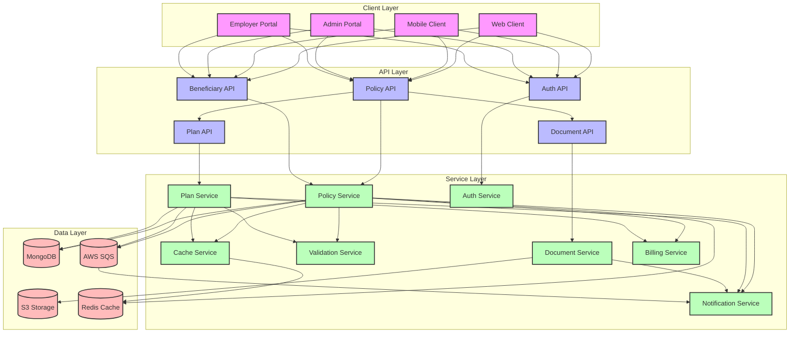
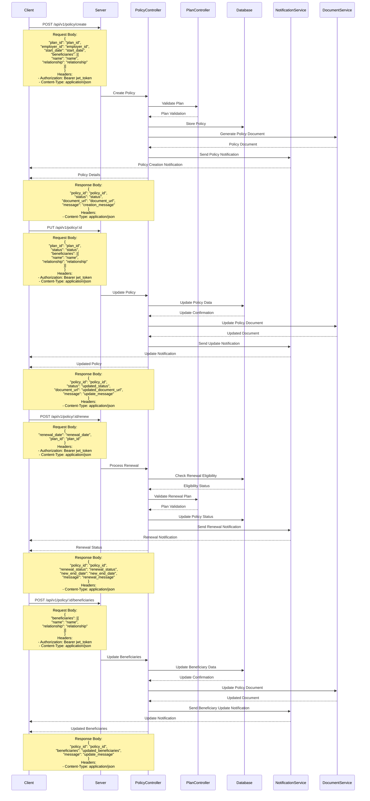

# Policy Management Flow

## Overview
The policy management flow in EmployeeSure handles the creation, modification, and management of insurance policies.

## High-Level Design



## Sequence Diagram



## API Endpoints

### Policy Creation
```http
POST /api/v1/policy/create
Content-Type: application/json
Authorization: Bearer <jwt_token>

{
    "plan_id": "string",
    "employer_id": "string",
    "start_date": "date",
    "beneficiaries": [
        {
            "name": "string",
            "relationship": "string"
        }
    ]
}
```

### Policy Update
```http
PUT /api/v1/policy/:id
Content-Type: application/json
Authorization: Bearer <jwt_token>

{
    "plan_id": "string",
    "status": "string",
    "beneficiaries": [
        {
            "name": "string",
            "relationship": "string"
        }
    ]
}
```

### Policy Renewal
```http
POST /api/v1/policy/:id/renew
Content-Type: application/json
Authorization: Bearer <jwt_token>

{
    "renewal_date": "date",
    "plan_id": "string"
}
```

### Beneficiary Management
```http
POST /api/v1/policy/:id/beneficiaries
Content-Type: application/json
Authorization: Bearer <jwt_token>

{
    "beneficiaries": [
        {
            "name": "string",
            "relationship": "string"
        }
    ]
}
```

## Data Models

### Policy Model
```javascript
{
    id: String,
    plan_id: String,
    employer_id: String,
    start_date: Date,
    end_date: Date,
    status: String,
    beneficiaries: [{
        name: String,
        relationship: String
    }],
    created_at: Date,
    updated_at: Date
}
```

### Beneficiary Model
```javascript
{
    id: String,
    policy_id: String,
    name: String,
    relationship: String,
    created_at: Date,
    updated_at: Date
}
```

### Plan Model
```javascript
{
    id: String,
    name: String,
    type: String,
    coverage: Object,
    created_at: Date,
    updated_at: Date
}
```

## Security Considerations

1. **Access Control**
   - Role-based access control for policy management
   - Policy data encryption
   - Document security
   - Audit logging

2. **Data Validation**
   - Policy data validation
   - Beneficiary validation
   - Date range validation

## Error Handling

### Common Error Codes
- 400: Bad Request - Invalid policy data
- 401: Unauthorized - Invalid token
- 403: Forbidden - Insufficient permissions
- 404: Not Found - Policy not found
- 409: Conflict - Policy already exists
- 422: Unprocessable Entity - Invalid beneficiary data
- 500: Internal Server Error - Server-side issues

### Error Response Format
```javascript
{
    "status": "error",
    "code": "ERROR_CODE",
    "message": "Error description",
    "details": {
        "field": "error_details"
    }
}
```

## Integration Points

1. **Plan Service**
   - Plan validation
   - Coverage verification
   - Premium calculation

2. **Document Service**
   - Policy document generation
   - Document updates
   - Document storage

3. **Notification Service**
   - Policy creation notifications
   - Update notifications
   - Renewal reminders
   - Beneficiary updates

## Best Practices

1. **Policy Management**
   - Regular status checks
   - Automated renewal reminders
   - Beneficiary validation
   - Document management

2. **Data Management**
   - Regular data backups
   - Audit logging
   - Data retention policies
   - Privacy compliance

3. **Performance**
   - Caching frequently accessed policies
   - Optimized database queries
   - Efficient document generation

4. **Monitoring**
   - Track policy creation rates
   - Monitor renewal success rates
   - Track beneficiary updates
   - Alert on policy issues