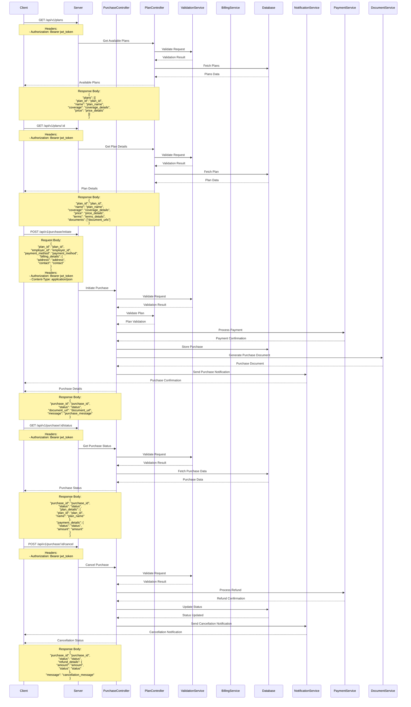

# Purchase Flow

## Overview
The purchase flow manages the process of selecting, purchasing, and activating insurance plans in the EmployeeSure system.

## High-Level Design

```mermaid
graph TB
    %% Client Layer
    subgraph ClientLayer[Client Layer]
        Web[Web Client]
        Mobile[Mobile Client]
        AdminPortal[Admin Portal]
        EmployerPortal[Employer Portal]
    end

    %% API Layer
    subgraph APILayer[API Layer]
        PurchaseAPI[Purchase API]
        ValidationAPI[Validation API]
        AuthAPI[Auth API]
        PlanAPI[Plan API]
        BillingAPI[Billing API]
        DocumentAPI[Document API]
    end

    %% Service Layer
    subgraph ServiceLayer[Service Layer]
        subgraph CoreServices[Core Services]
            PurchaseService[Purchase Service]
            PlanService[Plan Service]
            BillingService[Billing Service]
        end
        
        subgraph InternalServices[Internal Support Services]
            ValidationService[Validation Service]
            AuthService[Auth Service]
            CacheService[Cache Service]
            AuditService[Audit Service]
        end

        subgraph ExternalServices[External Services]
            NotificationService[Notification Service]
            DocumentService[Document Service]
            PaymentService[Payment Service]
        end
    end

    %% Data Layer
    subgraph DataLayer[Data Layer]
        DB[(MongoDB)]
        S3[(S3 Storage)]
        Cache[(Redis Cache)]
        Queue[(AWS SQS)]
    end

    %% Client to API Connections
    Web --> PurchaseAPI
    Web --> AuthAPI
    Web --> ValidationAPI
    Web --> PlanAPI
    Web --> BillingAPI
    Web --> DocumentAPI
    Mobile --> PurchaseAPI
    Mobile --> AuthAPI
    Mobile --> ValidationAPI
    Mobile --> PlanAPI
    Mobile --> BillingAPI
    Mobile --> DocumentAPI
    AdminPortal --> PurchaseAPI
    AdminPortal --> AuthAPI
    AdminPortal --> ValidationAPI
    AdminPortal --> PlanAPI
    AdminPortal --> BillingAPI
    AdminPortal --> DocumentAPI
    EmployerPortal --> PurchaseAPI
    EmployerPortal --> AuthAPI
    EmployerPortal --> ValidationAPI
    EmployerPortal --> PlanAPI
    EmployerPortal --> BillingAPI
    EmployerPortal --> DocumentAPI

    %% API to Service Connections
    PurchaseAPI --> PurchaseService
    ValidationAPI --> ValidationService
    AuthAPI --> AuthService
    PlanAPI --> PlanService
    BillingAPI --> BillingService
    DocumentAPI --> DocumentService

    %% Core Service Connections
    PurchaseService --> ValidationService
    PurchaseService --> NotificationService
    PurchaseService --> PlanService
    PurchaseService --> BillingService
    PurchaseService --> CacheService
    PurchaseService --> DocumentService
    PurchaseService --> AuditService
    PurchaseService --> PaymentService
    PlanService --> ValidationService
    PlanService --> CacheService
    PlanService --> DocumentService
    PlanService --> AuditService
    BillingService --> ValidationService
    BillingService --> CacheService
    BillingService --> NotificationService
    BillingService --> AuditService
    BillingService --> PaymentService

    %% Service to Data Connections
    PurchaseService --> DB
    PurchaseService --> Queue
    PlanService --> DB
    PlanService --> Cache
    BillingService --> DB
    BillingService --> Queue
    ValidationService --> DB
    ValidationService --> Cache
    DocumentService --> DB
    DocumentService --> S3
    AuditService --> DB
    AuditService --> S3
    CacheService --> Cache

    %% Styling
    classDef client fill:#f9f,stroke:#333,stroke-width:2px
    classDef api fill:#bbf,stroke:#333,stroke-width:2px
    classDef coreService fill:#bfb,stroke:#333,stroke-width:2px
    classDef internalService fill:#fbb,stroke:#333,stroke-width:2px
    classDef externalService fill:#ff9,stroke:#333,stroke-width:2px
    classDef data fill:#ddd,stroke:#333,stroke-width:2px

    class Web,Mobile,AdminPortal,EmployerPortal client
    class PurchaseAPI,ValidationAPI,AuthAPI,PlanAPI,BillingAPI,DocumentAPI api
    class PurchaseService,PlanService,BillingService coreService
    class ValidationService,AuthService,CacheService,AuditService internalService
    class NotificationService,DocumentService,PaymentService externalService
    class DB,S3,Cache,Queue data
```



## Sequence Diagram



## API Endpoints

### Get Available Plans
```http
GET /api/v1/plans
Authorization: Bearer <jwt_token>
```

### Get Plan Details
```http
GET /api/v1/plans/:id
Authorization: Bearer <jwt_token>
```

### Initiate Purchase
```http
POST /api/v1/purchase/initiate
Content-Type: application/json
Authorization: Bearer <jwt_token>

{
    "plan_id": "string",
    "employer_id": "string",
    "payment_method": "string",
    "billing_details": {
        "address": "string",
        "contact": "string"
    }
}
```

### Get Purchase Status
```http
GET /api/v1/purchase/:id/status
Authorization: Bearer <jwt_token>
```

### Cancel Purchase
```http
POST /api/v1/purchase/:id/cancel
Authorization: Bearer <jwt_token>
```

### List Purchases
```http
GET /api/v1/purchases
Authorization: Bearer <jwt_token>
Query Parameters:
- status: string (optional)
- employer_id: string (optional)
- start_date: date (optional)
- end_date: date (optional)
```

### Get Purchase Documents
```http
GET /api/v1/purchase/:id/documents
Authorization: Bearer <jwt_token>
```

## Data Models

### Purchase Model
```javascript
{
    id: String,
    plan_id: String,
    employer_id: String,
    payment_method: String,
    billing_details: {
        address: String,
        contact: String
    },
    status: String,
    created_at: Date,
    updated_at: Date
}
```

### Plan Model
```javascript
{
    id: String,
    name: String,
    coverage: Object,
    price: {
        amount: Number,
        currency: String,
        billing_cycle: String
    },
    created_at: Date,
    updated_at: Date
}
```

## Security Considerations

1. **Payment Security**
   - Secure payment processing
   - Payment data encryption
   - PCI compliance
   - Fraud prevention

2. **Access Control**
   - Role-based access control
   - Purchase validation
   - Audit logging

3. **Data Security**
   - Secure data transmission
   - Data encryption
   - Session management

## Error Handling

### Common Error Codes
- 400: Bad Request - Invalid purchase data
- 401: Unauthorized - Invalid token
- 403: Forbidden - Insufficient permissions
- 404: Not Found - Plan not found
- 422: Unprocessable Entity - Invalid payment data
- 500: Internal Server Error - Server-side issues

### Error Response Format
```javascript
{
    "status": "error",
    "code": "ERROR_CODE",
    "message": "Error description",
    "details": {
        "field": "error_details"
    }
}
```

## Integration Points

1. **Payment System**
   - Payment processing
   - Transaction tracking
   - Refund handling

2. **Plan Service**
   - Plan validation
   - Coverage verification
   - Price calculation

3. **Document Service**
   - Purchase document generation
   - Document storage
   - Document retrieval

4. **Notification Service**
   - Purchase notifications
   - Payment confirmations
   - Status updates

## Best Practices

1. **Purchase Process**
   - Validate all inputs
   - Handle payment failures
   - Maintain transaction consistency

2. **Security**
   - Implement proper authentication
   - Use secure communication
   - Follow security guidelines

3. **Performance**
   - Optimize database queries
   - Use caching effectively
   - Handle concurrent requests

4. **Monitoring**
   - Track purchase metrics
   - Monitor payment processing
   - Log important events
``` 