# Subscription Management Flow

## Overview
The subscription management flow handles the creation, modification, and management of insurance subscriptions in the EmployeeSure system.

## High-Level Design

```mermaid
graph TB
    %% Client Layer
    subgraph ClientLayer[Client Layer]
        Web[Web Client]
        Mobile[Mobile Client]
        AdminPortal[Admin Portal]
        EmployerPortal[Employer Portal]
    end

    %% API Layer
    subgraph APILayer[API Layer]
        SubscriptionAPI[Subscription API]
        ValidationAPI[Validation API]
        AuthAPI[Auth API]
        PlanAPI[Plan API]
        BillingAPI[Billing API]
        PaymentAPI[Payment API]
        DocumentAPI[Document API]
    end

    %% Service Layer
    subgraph ServiceLayer[Service Layer]
        subgraph CoreServices[Core Services]
            SubscriptionService[Subscription Service]
            PlanService[Plan Service]
            BillingService[Billing Service]
        end
        
        subgraph InternalServices[Internal Services]
            ValidationService[Validation Service]
            AuthService[Auth Service]
            CacheService[Cache Service]
            AuditService[Audit Service]
        end

        subgraph ExternalServices[External Services]
            NotificationService[Notification Service]
            DocumentService[Document Service]
            PaymentService[Payment Service]
            ReportService[Report Service]
        end
    end

    %% Data Layer
    subgraph DataLayer[Data Layer]
        DB[(MongoDB)]
        S3[(S3 Storage)]
        Cache[(Redis Cache)]
        Queue[(AWS SQS)]
    end

    %% Client to API Connections
    Web --> SubscriptionAPI
    Web --> AuthAPI
    Web --> PlanAPI
    Web --> BillingAPI
    Web --> ValidationAPI
    Web --> PaymentAPI
    Web --> DocumentAPI
    Mobile --> SubscriptionAPI
    Mobile --> AuthAPI
    Mobile --> PlanAPI
    Mobile --> BillingAPI
    Mobile --> ValidationAPI
    Mobile --> PaymentAPI
    Mobile --> DocumentAPI
    AdminPortal --> SubscriptionAPI
    AdminPortal --> AuthAPI
    AdminPortal --> PlanAPI
    AdminPortal --> BillingAPI
    AdminPortal --> ValidationAPI
    AdminPortal --> PaymentAPI
    AdminPortal --> DocumentAPI
    EmployerPortal --> SubscriptionAPI
    EmployerPortal --> AuthAPI
    EmployerPortal --> PlanAPI
    EmployerPortal --> BillingAPI
    EmployerPortal --> ValidationAPI
    EmployerPortal --> PaymentAPI
    EmployerPortal --> DocumentAPI

    %% API to Service Connections
    SubscriptionAPI --> SubscriptionService
    ValidationAPI --> ValidationService
    AuthAPI --> AuthService
    PlanAPI --> PlanService
    BillingAPI --> BillingService
    PaymentAPI --> PaymentService
    DocumentAPI --> DocumentService

    %% Core Service to Validation API Connections
    SubscriptionService --> ValidationAPI
    PlanService --> ValidationAPI
    BillingService --> ValidationAPI

    %% Core Service Connections
    SubscriptionService --> NotificationService
    SubscriptionService --> PlanService
    SubscriptionService --> BillingService
    SubscriptionService --> CacheService
    SubscriptionService --> AuditService
    SubscriptionService --> PaymentAPI
    SubscriptionService --> DocumentAPI
    PlanService --> CacheService
    PlanService --> AuditService
    PlanService --> DocumentAPI
    BillingService --> CacheService
    BillingService --> AuditService
    BillingService --> PaymentAPI
    BillingService --> DocumentAPI

    %% Internal Service Connections
    ValidationService --> AuthService
    ValidationService --> CacheService
    ValidationService --> AuditService
    AuthService --> CacheService
    AuthService --> AuditService
    CacheService --> AuditService

    %% External Service Connections
    NotificationService --> DocumentAPI
    DocumentService --> PaymentAPI
    PaymentService --> ReportService

    %% Service to Data Connections
    SubscriptionService --> DB
    SubscriptionService --> Queue
    PlanService --> DB
    PlanService --> Cache
    BillingService --> DB
    BillingService --> S3
    BillingService --> Queue
    ValidationService --> DB
    ValidationService --> Cache
    DocumentService --> DB
    DocumentService --> S3
    PaymentService --> DB
    PaymentService --> Queue
    CacheService --> Cache
    AuditService --> DB
    AuditService --> S3

    %% Styling
    classDef client fill:#f9f,stroke:#333,stroke-width:2px
    classDef api fill:#bbf,stroke:#333,stroke-width:2px
    classDef coreService fill:#bfb,stroke:#333,stroke-width:2px
    classDef internalService fill:#fbb,stroke:#333,stroke-width:2px
    classDef externalService fill:#ff9,stroke:#333,stroke-width:2px
    classDef data fill:#ddd,stroke:#333,stroke-width:2px

    class Web,Mobile,AdminPortal,EmployerPortal client
    class SubscriptionAPI,ValidationAPI,AuthAPI,PlanAPI,BillingAPI,PaymentAPI,DocumentAPI api
    class SubscriptionService,PlanService,BillingService coreService
    class ValidationService,AuthService,CacheService,AuditService internalService
    class NotificationService,DocumentService,PaymentService,ReportService externalService
    class DB,S3,Cache,Queue data
```



## Sequence Diagram

```mermaid
sequenceDiagram
    participant Client
    participant Server
    participant SubscriptionController
    participant PlanController
    participant ValidationService
    participant Database
    participant NotificationService
    participant PaymentService
    participant DocumentService
    participant AuditService

    %% Subscription Creation Flow
    Client->>Server: POST /api/v1/subscription/create
    Note over Client,Server: Request Body:<br/>{<br/>  "plan_id": "plan_id",<br/>  "employer_id": "employer_id",<br/>  "start_date": "start_date",<br/>  "payment_details": {<br/>    "method": "method",<br/>    "amount": "amount"<br/>  }<br/>}<br/>Headers:<br/>- Authorization: Bearer jwt_token<br/>- Content-Type: application/json
    Server->>SubscriptionController: Create Subscription
    SubscriptionController->>ValidationService: Validate Request
    ValidationService-->>SubscriptionController: Validation Result
    SubscriptionController->>PlanController: Validate Plan
    PlanController-->>SubscriptionController: Plan Validation
    SubscriptionController->>PaymentService: Process Initial Payment
    PaymentService-->>SubscriptionController: Payment Confirmation
    SubscriptionController->>Database: Store Subscription
    SubscriptionController->>DocumentService: Generate Subscription Document
    DocumentService-->>SubscriptionController: Subscription Document
    SubscriptionController->>AuditService: Log Subscription Creation
    AuditService-->>SubscriptionController: Audit Confirmation
    SubscriptionController->>NotificationService: Send Subscription Notification
    NotificationService-->>Client: Subscription Creation Notification
    SubscriptionController-->>Client: Subscription Details
    Note over SubscriptionController,Client: Response Body:<br/>{<br/>  "subscription_id": "subscription_id",<br/>  "status": "status",<br/>  "document_url": "document_url",<br/>  "message": "creation_message"<br/>}<br/>Headers:<br/>- Content-Type: application/json

    %% Subscription Update Flow
    Client->>Server: PUT /api/v1/subscription/:id
    Note over Client,Server: Request Body:<br/>{<br/>  "plan_id": "plan_id",<br/>  "end_date": "end_date",<br/>  "status": "status"<br/>}<br/>Headers:<br/>- Authorization: Bearer jwt_token<br/>- Content-Type: application/json
    Server->>SubscriptionController: Update Subscription
    SubscriptionController->>ValidationService: Validate Request
    ValidationService-->>SubscriptionController: Validation Result
    SubscriptionController->>Database: Update Subscription Data
    Database-->>SubscriptionController: Update Confirmation
    SubscriptionController->>DocumentService: Update Subscription Document
    DocumentService-->>SubscriptionController: Updated Document
    SubscriptionController->>AuditService: Log Subscription Update
    AuditService-->>SubscriptionController: Audit Confirmation
    SubscriptionController->>NotificationService: Send Update Notification
    NotificationService-->>Client: Update Notification
    SubscriptionController-->>Client: Updated Subscription
    Note over SubscriptionController,Client: Response Body:<br/>{<br/>  "subscription_id": "subscription_id",<br/>  "status": "updated_status",<br/>  "document_url": "updated_document_url",<br/>  "message": "update_message"<br/>}<br/>Headers:<br/>- Content-Type: application/json

    %% Subscription Renewal Flow
    Client->>Server: POST /api/v1/subscription/:id/renew
    Note over Client,Server: Request Body:<br/>{<br/>  "renewal_date": "renewal_date",<br/>  "plan_id": "plan_id",<br/>  "payment_details": {<br/>    "method": "method",<br/>    "amount": "amount"<br/>  }<br/>}<br/>Headers:<br/>- Authorization: Bearer jwt_token<br/>- Content-Type: application/json
    Server->>SubscriptionController: Process Renewal
    SubscriptionController->>ValidationService: Validate Request
    ValidationService-->>SubscriptionController: Validation Result
    SubscriptionController->>Database: Check Renewal Eligibility
    Database-->>SubscriptionController: Eligibility Status
    SubscriptionController->>PlanController: Validate Renewal Plan
    PlanController-->>SubscriptionController: Plan Validation
    SubscriptionController->>PaymentService: Process Renewal Payment
    PaymentService-->>SubscriptionController: Payment Confirmation
    SubscriptionController->>Database: Update Subscription Status
    SubscriptionController->>AuditService: Log Subscription Renewal
    AuditService-->>SubscriptionController: Audit Confirmation
    SubscriptionController->>NotificationService: Send Renewal Notification
    NotificationService-->>Client: Renewal Notification
    SubscriptionController-->>Client: Renewal Status
    Note over SubscriptionController,Client: Response Body:<br/>{<br/>  "subscription_id": "subscription_id",<br/>  "renewal_status": "renewal_status",<br/>  "new_end_date": "new_end_date",<br/>  "message": "renewal_message"<br/>}<br/>Headers:<br/>- Content-Type: application/json

    %% Subscription Status Flow
    Client->>Server: GET /api/v1/subscription/:id/status
    Note over Client,Server: Headers:<br/>- Authorization: Bearer jwt_token
    Server->>SubscriptionController: Get Subscription Status
    SubscriptionController->>ValidationService: Validate Request
    ValidationService-->>SubscriptionController: Validation Result
    SubscriptionController->>Database: Fetch Subscription Data
    Database-->>SubscriptionController: Subscription Data
    SubscriptionController-->>Client: Subscription Status
    Note over SubscriptionController,Client: Response Body:<br/>{<br/>  "subscription_id": "subscription_id",<br/>  "status": "status",<br/>  "plan_details": {<br/>    "plan_id": "plan_id",<br/>    "name": "plan_name",<br/>    "type": "plan_type"<br/>  },<br/>  "payment_details": {<br/>    "status": "status",<br/>    "next_payment_date": "date"<br/>  }<br/>}<br/>Headers:<br/>- Content-Type: application/json

    %% Plan Management Flow
    Client->>Server: POST /api/v1/plan/create
    Note over Client,Server: Request Body:<br/>{<br/>  "name": "name",<br/>  "type": "type",<br/>  "features": ["features"],<br/>  "pricing": {<br/>    "amount": "amount",<br/>    "currency": "currency",<br/>    "billing_cycle": "cycle"<br/>  }<br/>}<br/>Headers:<br/>- Authorization: Bearer jwt_token<br/>- Content-Type: application/json
    Server->>PlanController: Create Plan
    PlanController->>ValidationService: Validate Request
    ValidationService-->>PlanController: Validation Result
    PlanController->>Database: Store Plan
    PlanController->>AuditService: Log Plan Creation
    AuditService-->>PlanController: Audit Confirmation
    PlanController->>NotificationService: Send Plan Creation Notification
    NotificationService-->>Client: Plan Creation Notification
    PlanController-->>Client: Plan Details
    Note over PlanController,Client: Response Body:<br/>{<br/>  "plan_id": "plan_id",<br/>  "status": "status",<br/>  "message": "creation_message"<br/>}<br/>Headers:<br/>- Content-Type: application/json
```



## API Endpoints

### Subscription Creation
```http
POST /api/v1/subscription/create
Content-Type: application/json
Authorization: Bearer <jwt_token>

{
    "plan_id": "string",
    "employer_id": "string",
    "start_date": "date",
    "payment_details": {
        "method": "string",
        "amount": "number"
    }
}
```

### Subscription Update
```http
PUT /api/v1/subscription/:id
Content-Type: application/json
Authorization: Bearer <jwt_token>

{
    "plan_id": "string",
    "end_date": "date",
    "status": "string"
}
```

### Subscription Renewal
```http
POST /api/v1/subscription/:id/renew
Content-Type: application/json
Authorization: Bearer <jwt_token>

{
    "renewal_date": "date",
    "plan_id": "string",
    "payment_details": {
        "method": "string",
        "amount": "number"
    }
}
```

### Subscription Status
```http
GET /api/v1/subscription/:id/status
Authorization: Bearer <jwt_token>
```

### Plan Creation
```http
POST /api/v1/plan/create
Content-Type: application/json
Authorization: Bearer <jwt_token>

{
    "name": "string",
    "type": "string",
    "features": ["string"],
    "pricing": {
        "amount": "number",
        "currency": "string",
        "billing_cycle": "string"
    }
}
```

## Data Models

### Subscription Model
```javascript
{
    id: String,
    plan_id: String,
    employer_id: String,
    start_date: Date,
    end_date: Date,
    status: String,
    payment_details: {
        method: String,
        amount: Number,
        status: String,
        next_payment_date: Date
    },
    created_at: Date,
    updated_at: Date
}
```

## Security Considerations

1. **Access Control**
   - Role-based access control for subscription management
   - Subscription data encryption
   - Secure payment processing
   - Audit logging

2. **Data Validation**
   - Subscription data validation
   - Payment information validation
   - Date range validation

## Error Handling

### Common Error Codes
- 400: Bad Request - Invalid subscription data
- 401: Unauthorized - Invalid token
- 403: Forbidden - Insufficient permissions
- 404: Not Found - Subscription not found
- 409: Conflict - Subscription already exists
- 422: Unprocessable Entity - Invalid payment data
- 500: Internal Server Error - Server-side issues

### Error Response Format
```javascript
{
    "status": "error",
    "code": "ERROR_CODE",
    "message": "Error description",
    "details": {
        "field": "error_details"
    }
}
```

## Integration Points

1. **Plan Service**
   - Plan validation
   - Coverage verification
   - Premium calculation

2. **Payment Service**
   - Payment processing
   - Transaction tracking

3. **Document Service**
   - Subscription document generation
   - Document updates
   - Document storage

4. **Notification Service**
   - Subscription creation notifications
   - Update notifications
   - Renewal reminders
   - Payment notifications

## Best Practices

1. **Subscription Management**
   - Regular status checks
   - Automated renewal reminders
   - Coverage validation
   - Payment tracking

2. **Data Management**
   - Regular data backups
   - Audit logging
   - Data retention policies
   - Privacy compliance

3. **Performance**
   - Caching frequently accessed subscriptions
   - Optimized database queries
   - Efficient document generation

4. **Monitoring**
   - Track subscription creation rates
   - Monitor renewal success rates
   - Track payment processing
   - Alert on subscription issues