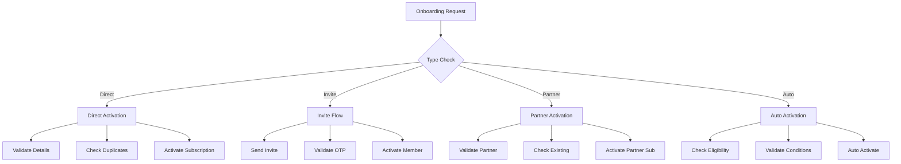
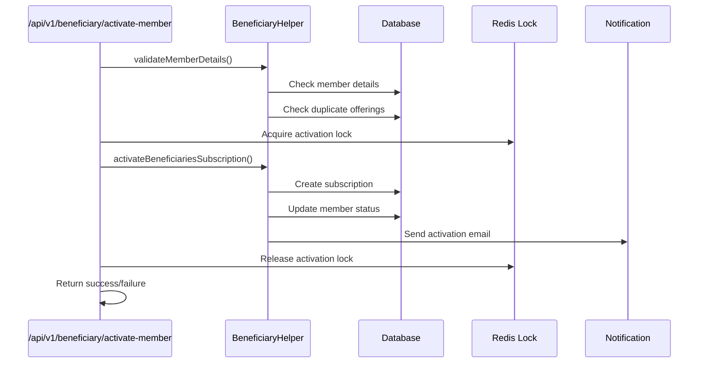
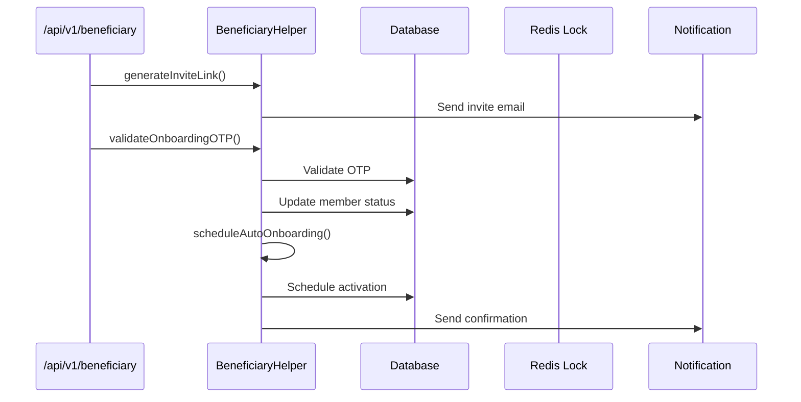
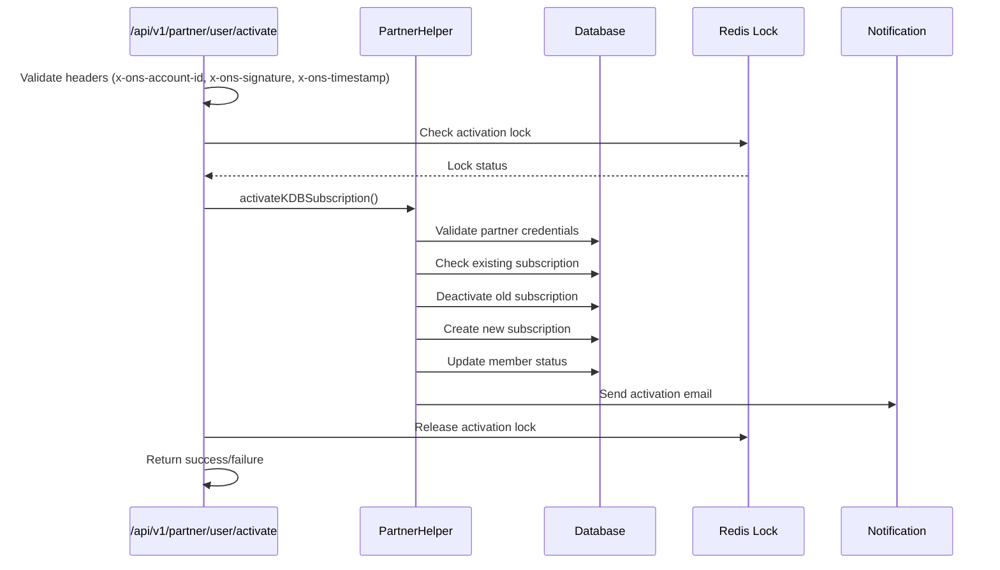
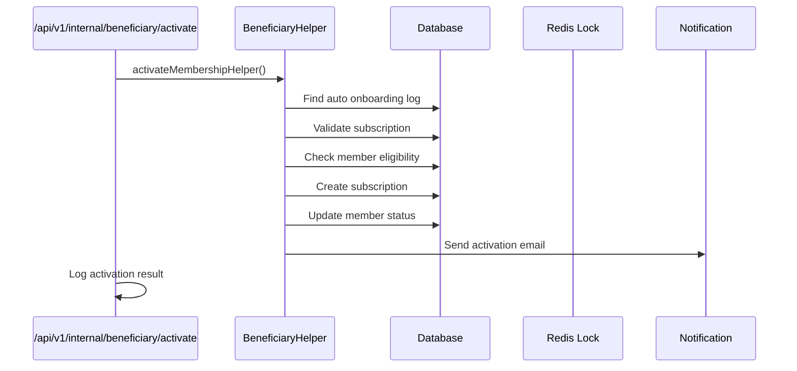

# Onboarding and Activation Flow Documentation

## Overview
The onboarding and activation system in EmployeeSure handles the process of adding new members to the platform, validating their information, and activating their subscriptions. This document outlines the different onboarding flows and their implementation details.

## Types of Onboarding

### 1. Direct Activation
- **Trigger**: When member details are complete and plan allows direct activation
- **Flow**:
  1. Validates member details
  2. Checks for duplicate core offerings
  3. Activates beneficiary subscription
  4. Updates member status to 'activated'
  5. Sends activation confirmation

### 2. Invite-Based Activation
- **Trigger**: When member needs to be invited first
- **Flow**:
  1. Generates and sends invite link
  2. Member completes onboarding
  3. Validates OTP
  4. Activates subscription
  5. Updates member status

### 3. Partner Integration Activation
- **Trigger**: When activation is initiated through partner integration
- **Flow**:
  1. Validates partner credentials
  2. Checks for existing subscriptions
  3. Activates partner subscription
  4. Updates member status
  5. Handles KDB specific flows

### 4. Auto Activation
- **Trigger**: Scheduled activation after invite period
- **Flow**:
  1. Validates member eligibility
  2. Checks activation conditions
  3. Activates subscription
  4. Updates member status
  5. Sends activation notification

## API Endpoints

### Internal APIs
1. `/api/v1/beneficiary/activate-member` - Main activation endpoint
2. `/api/v1/beneficiary/check-pending-activation` - Check activation status
3. `/api/v1/beneficiary/validate-otp` - Validate activation OTP
4. `/api/v1/beneficiary/get-email-activation-otp` - Get activation OTP

### Partner APIs
1. `/api/v1/partner/user/activate` - Partner activation endpoint

## Onboarding Process Flow



## Detailed Control Flows

### 1. Direct Activation Flow


### 2. Invite-Based Activation Flow


### 3. Partner Integration Flow


#### Partner Integration API Details
- **Endpoint**: `/api/v1/partner/user/activate`
- **Method**: POST
- **Required Headers**:
  - `x-ons-account-id`: Partner account identifier
  - `x-ons-signature`: Request signature
  - `x-ons-timestamp`: Request timestamp
- **Request Body**:
  ```json
  {
    "phone_number": "string",
    "email_id": "string",
    "dob": "string (date)",
    "gender": "string (M/F/O)",
    "plan_subscription_id": "string",
    "name": "string",
    "partner_user_id": "string",
    "govt_id_value": "string",
    "govt_id_name": "string (pan/aadhar/passport/license)",
    "addr_line": "string",
    "city": "string",
    "state": "string",
    "pincode": "string",
    "nominee_details": {
      "age": "number",
      "name": "string",
      "relation": "string"
    },
    "fields": "array"
  }
  ```
- **Response**:
  ```json
  {
    "success": "boolean",
    "message": "string",
    "data": {
      "subscription_id": "string",
      "status": "string"
    }
  }
  ```

### 4. Auto Activation Flow


#### Auto Activation API Details
- **Endpoint**: `/api/v1/internal/beneficiary/activate`
- **Method**: POST
- **Request Body**:
  ```json
  {
    "parent_subscription_id": "string",
    "phone_number": "string",
    "email_id": "string"
  }
  ```
- **Response**:
  ```json
  {
    "success": "boolean",
    "message": "string",
    "data": {
      "subscription_id": "string",
      "activation_date": "string"
    }
  }
  ```

#### Auto Activation Scheduling
- **Endpoint**: `/api/v1/beneficiary/schedule-auto-activation`
- **Method**: POST
- **Request Body**:
  ```json
  {
    "subscription_id": "string",
    "phone_number": "string",
    "email_id": "string",
    "activation_date": "number (unix timestamp)"
  }
  ```
- **Response**:
  ```json
  {
    "success": "boolean",
    "message": "string",
    "data": {
      "scheduled_date": "string"
    }
  }
  ```

## Key Components

### 1. Beneficiary Helper
- Handles core activation logic
- Manages member validation
- Processes different types of activations

### 2. Activation Locking
- Implements Redis-based locking
- Prevents concurrent activations
- Ensures data consistency

### 3. Notification System
- Sends activation emails
- Handles invite communications
- Manages OTP delivery

## Error Handling

1. **Validation Errors**
   - Invalid member details
   - Duplicate subscriptions
   - Invalid OTP

2. **Process Errors**
   - Concurrent activation attempts
   - Database operation failures
   - Integration failures

3. **Recovery Mechanisms**
   - Automatic lock release
   - Error logging
   - Status tracking

## Best Practices

1. **Before Activation**
   - Validate all member details
   - Check for existing subscriptions
   - Verify plan eligibility

2. **During Activation**
   - Use transaction where applicable
   - Implement proper locking
   - Log all actions

3. **After Activation**
   - Send notifications
   - Update audit logs
   - Clean up temporary data

## Monitoring and Logging

1. **Activity Tracking**
   - Activation requests
   - Success/failure status
   - Processing time

2. **Error Monitoring**
   - Failed activations
   - System errors
   - Integration issues

3. **Audit Logs**
   - User actions
   - System changes
   - Integration events 