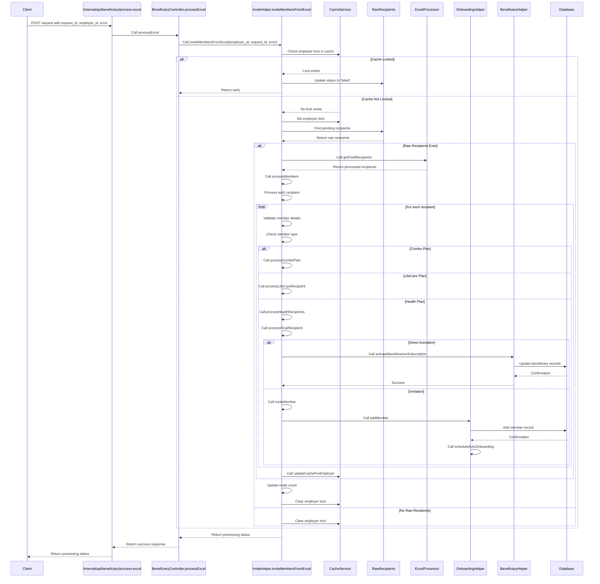

# API Documentation: Process Excel Endpoint

## Endpoint
```
POST /internal/api/beneficiary/process-excel
```

## Description
This endpoint processes an Excel file containing beneficiary data for onboarding members into the system. It handles the asynchronous processing of member invitations and activations based on the provided Excel data.

## Request Body
```json
{
    "request_id": "string",    // Unique identifier for the request
    "employer_id": "string",   // ID of the employer
    "error": "boolean"         // Optional error flag
}
```

## Response
```json
{
    "success": 1,
    "data": {
        "status": "processing"
    }
}
```

## Functional Sequence Flow Diagram



## Detailed Flow Description

1. **Initial Request Processing**
   - Request received at `/internal/api/beneficiary/process-excel`
   - `BeneficiaryController.processExcel` handles initial request
   - Calls `InviteHelper.inviteMembersFromExcel`

2. **Cache Management**
   - Checks for existing employer lock in cache
   - If locked, marks request as failed
   - If not locked, sets cache lock for employer

3. **Data Processing**
   - Fetches raw recipients with 'pending' status
   - Processes through `ExcelProcessor.getFinalRecipients`
   - Handles different member types:
     - Combo plans
     - LifeCare plans
     - Health plans

4. **Member Processing**
   - For each member type:
     - Validates member details
     - Checks for existing members
     - Processes based on activation type:
       - Direct activation via `activateBeneficiariesSubscription`
       - Invitation via `inviteMember`

5. **Post-Processing**
   - Updates employer cache
   - Updates invite count
   - Clears cache lock
   - Handles notifications

## Key Components

1. **BeneficiaryController**
   - Entry point for API requests
   - Manages response formatting

2. **InviteHelper**
   - Core processing logic
   - Member type handling
   - Activation/invitation flow

3. **ExcelProcessor**
   - Excel data processing
   - Column mapping
   - Data validation

4. **OnboardingHelper**
   - Member addition
   - Auto-onboarding scheduling
   - Error handling

5. **CacheService**
   - Employer lock management
   - Cache updates
   - Concurrent processing prevention

## Error Handling

- Validates employer existence and active status
- Handles duplicate processing attempts
- Manages Excel format errors
- Processes validation errors for member data
- Handles activation/invitation failures

## Data Flow

1. **Raw Data Processing**
   ```
   Excel File → Raw Recipients → Final Recipients → Processed Members
   ```

2. **Member Processing**
   ```
   Member Data → Validation → Type Check → Activation/Invitation → Cache Update
   ```

3. **Notification Flow**
   ```
   Processing Complete → Update Counts → Clear Locks → Send Notifications
   ```

## Notes

- Process is asynchronous
- Supports multiple member types
- Handles both direct activation and invitation workflows
- Includes cache management for concurrent processing
- Provides comprehensive error handling
- Supports auto-onboarding scheduling

This endpoint is part of a larger member onboarding system and integrates with various other components for complete member management.
